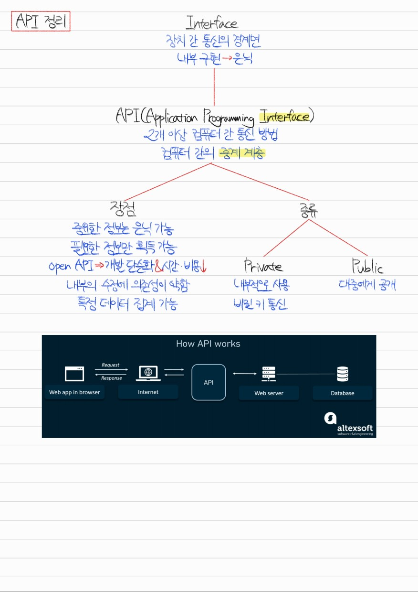
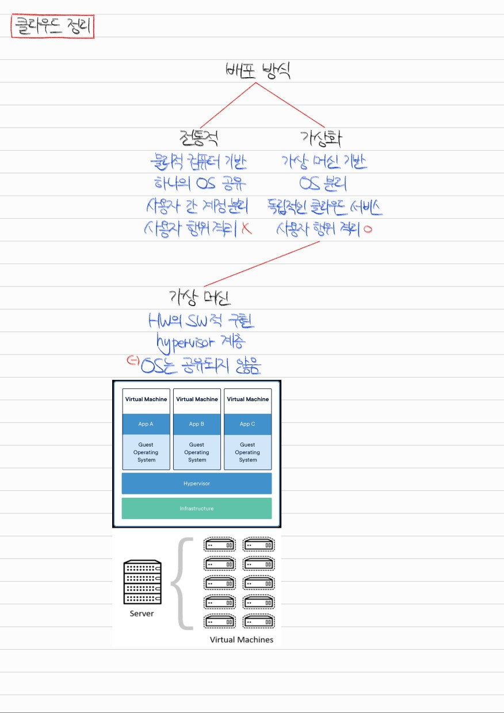
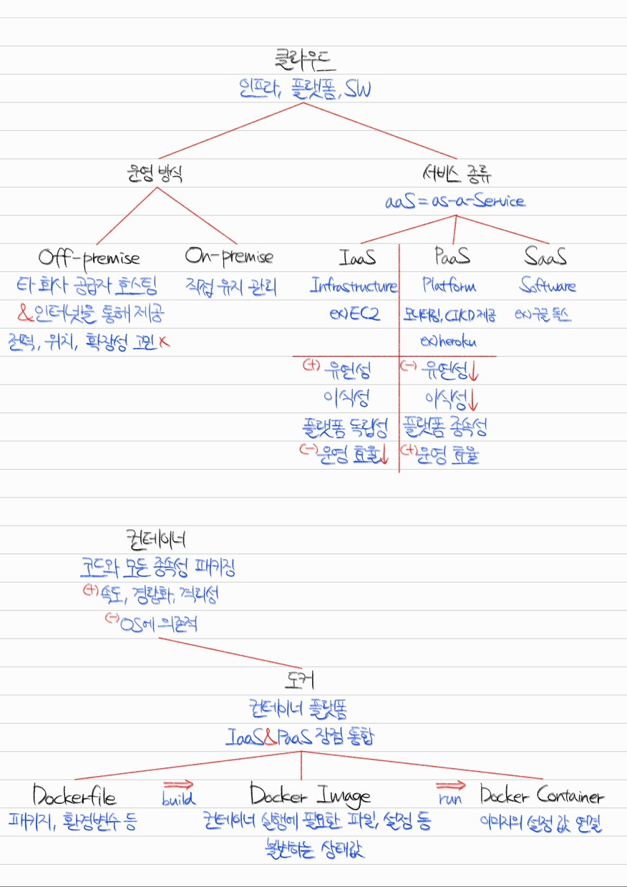
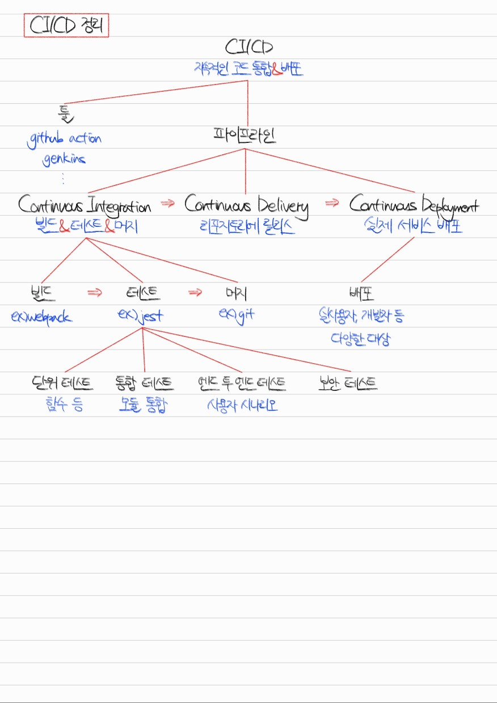

# Section 0. 개발자 필수 지식

## 데이터 교환 형식 # 1. JSON과 역직렬화/직렬화

Q1. JSON에 대해 설명하세요.

JSON은 JavaScript Object Notation의 줄임말로, 자바스크립트 객체 문법을 사용한 데이터 교환 형식을 말합니다.

플랫폼 독립적인 데이터 형식이기 때문에 자바스크립트, 자바, 파이썬 등 다양한 언어와 다양한 시스템에서 사용할 수 있습니다. 그렇기 때문에 API 반환 형식 또는 package.json과 같은 시스템 구성 설정 파일 등에 사용됩니다.

JSON.parse()를 사용하여 역직렬화하고, JSON.stringify()를 사용하여 직렬화할 수 있습니다.

Q2. 직렬화와 역직렬화에 대해 설명하고 그것이 왜 필요한지 설명하세요.

직렬화란 JSON 객체를 바이트 형식으로 변환하는 것을 말합니다. 직렬화는 다양한 플랫폼에서 객체를 불러올 수 있게 하기 위해 사용됩니다.

역직렬화란 바이트 형식을 JSON 객체로 변환하는 것을 말합니다. 역직렬화는 특정 플랫폼에서 객체를 직접 사용할 수 있게 하기 위해 사용됩니다.

## 데이터 교환 형식 # 2. XML

Q1. XML에 대해 설명하세요.

XML이란 태그로 특징되는 마크업 형태를 쓰는 데이터 교환 형식입니다. 키의 이름으로 태그를 정의하고, 시작 태그와 종료 태그 사이에 키의 값을 포함하는 형태입니다.

XML 문서는 버전 및 인코딩 정보를 담고 있는 프롤로그, 단 한 번만 나타나는 루트 요소, 루트 요소 하위에 존재하는 하위 요소들로 구성됩니다.

Q2. XML과 HTML의 차이점에 대해 설명하세요.

XML은 데이터 저장과 전송 용도로 사용되며, 태그를 사용자가 정의하여 사용해야 되고, 태그명이 대소문자를 구분합니다.

반면 HTML은 데이터 표시 용도로 사용되며, 미리 정의된 태그를 사용해야 되고, 태그명이 대소문자를 구분하지 않습니다.

Q3. 데이터 교환 형식으로 XML과 JSON 중 어떤 것이 더 적합할지 논리적으로 설명하세요.

상황에 따라 적합한 선택지는 다를 수 있겠지만, 저라면 JSON을 선택하겠습니다.

그 이유는 XML의 경우 종료 태그가 차지하는 용량 때문에 기본적으로 데이터가 무거워지고, 노드 환경에서 자바스크립트 객체로 파싱할 때에도 내장 라이브러리가 지원되지 않고 xml2json 같은 외부 라이브러리를 사용해야 한다는 불편함이 있기 때문입니다.

## API

Q4. API란 무엇인지 설명하세요.

Application Programming Interface, 줄여서 API란 컴퓨터 간 존재하는 중계 계층입니다. 2개 이상의 컴퓨터가 통신할 때 API를 인터페이스로 두고 통신합니다.

Q5. API의 장점은 무엇입니까?

제공자의 입장에선 내부 구현을 은닉하고 특정 정보만 제공할 수 있는 것, 서버 내부 구조의 수정에 따른 의존성이 약해 API는 수정할 필요가 적은 것이 장점입니다.

사용자의 입장에선 필요한 데이터만 요청할 수 있는 것이 장점입니다.

또한, Open API를 사용하면 개발 단계가 간소화되고 적은 비용으로 개발할 수 있습니다.

## 클라우드

Q6. 클라우드 서비스란 무엇인지 설명하세요.

클라우드 서비스란 Off-premise 방식으로 다른 기업의 공급자가 호스팅하여 인터넷을 통해 제공하는 인프라, 플랫폼, 또는 소프트웨어입니다.

Q7. On-premise와 Off-premise의 차이점은 무엇입니까?

Off-premise는 다른 기업의 공급자가 인터넷을 통해 인프라를 제공하는 방식이고, On-premise는 개인 또는 기업이 직접 데이터 센터를 구축 및 유지보수하는 방식입니다.

Q8. IaaS, PaaS, SaaS란 무엇입니까?

IaaS는 Infrastructure-as-a-Service, PaaS는 Platform-as-a-Service, SaaS는 Software-as-a-Service를 의미합니다.

클라우드 서비스 제공 시 해당 서비스가 인프라를 제공하는 형태로 되어 있느냐, 플랫폼을 제공하는 형태로 되어 있느냐, 소프트웨어를 제공하는 형태로 되어 있느냐의 차이입니다.

IaaS의 대표적인 예시는 EC2, PaaS의 대표적인 예시는 heroku, SaaS의 대표적인 예시는 구글 Docs입니다.

Q9. IaaS와 PaaS의 차이점은 무엇입니까?

IaaS는 유연성, 이식성이 높고 플랫폼과 독립적이라는 장점을 가진 대신 운영 효율이 떨어진다는 단점이 있습니다.

PaaS는 유연성, 이식성이 낮고 플랫폼에 종속적이라는 단점을 가진 대신 운영 효율이 높다는 장점이 있습니다.

Q10. 컨테이너와 도커에 대해 설명해주세요.

컨테이너란 애플리케이션 실행에 필요한 모든 코드와 종속성을 패키징한 하나의 단위입니다. 가상 머신 위에서 애플리케이션을 돌릴 때와 비교하면, 하나의 OS를 공유하기 때문에 속도가 빠르고, 경량화되어 있고, 어느 정도의 격리성이 보장된다는 장점이 있습니다. 그러나 OS에 의존적이기 때문에 가상 머신만큼의 격리성이 보장되긴 어렵다는 단점이 있습니다.

도커는 컨테이너 운영을 위한 기능을 제공하는 플랫폼입니다. IaaS와 PaaS의 장점인 유연성, 이식성, 플랫폼 독립성, 운영 효율성을 모두 갖고 있습니다.

Dockerfile에 패키지와 환경 변수 등을 기록하고 빌드하면 도커 이미지가 생성됩니다. 도커 이미지는 컨테이너 실행에 필요한 파일, 설정 등을 담고 있는 하나의 상태 값으로 불변성이 가장 큰 특징입니다. 도커 이미지를 실행하면 도커 컨테이너가 생성되는데, 이때 컴퓨팅 자원과 도커 이미지의 설정 값이 연결됩니다.

Q11. 도커와 가상 머신의 차이점에 대해 설명하세요.

가상 머신은 OS에서 실행되는 VMware와 같은 Hypervisor가 있고, 그 위에 guest OS가 설치되어 하드웨어의 동작을 소프트웨어적으로 구현합니다. 사용자 간 OS가 공유되지 않기 때문에 완전한 격리성이 보장된다는 장점이 있지만, 컴퓨팅 자원을 많이 소모한다는 단점이 있습니다.

도커는 컨테이너 기술을 사용함으로써 하나의 OS 위에서 특정 이미지를 사용해 여러 개의 컨테이너를 운영합니다. 이렇게 함으로써 컴퓨팅 자원을 적게 소모하게 된다는 장점이 있지만 사용자 간 OS를 공유하기 때문에 완전한 격리성이 보장되지 않는다는 점은 유의해야 할 필요가 있습니다.

## CI/CD

Q12. CI/CD란 무엇인지 설명하세요.

CI/CD란 Continuous Integration, Continuous Deployment의 줄임말로 소프트웨어 개발 단계와 운영 단계를 하나의 파이프라인으로 통합한 것입니다. CI/CD 파이프라인은 계획하고, 코딩하고, 빌드하고, 테스트하고, 머지하는 Continuous Integration 과정, 리포지토리에 릴리즈하고, 실제 서비스를 배포하고, 운영하고, 모니터링하는 Continuous Deployment 과정이 반복됩니다.

여기서 Continuous는 '지속적'이라는 의미를 갖는 동시에 관점에 따라 '자동화된'이라는 의미를 가질 수도 있다고 생각합니다. 왜냐하면 github action, genkins 같은 툴을 사용해 파이프라인의 각 과정을 자동화하는 것이 CI/CD의 핵심이기 때문입니다.

