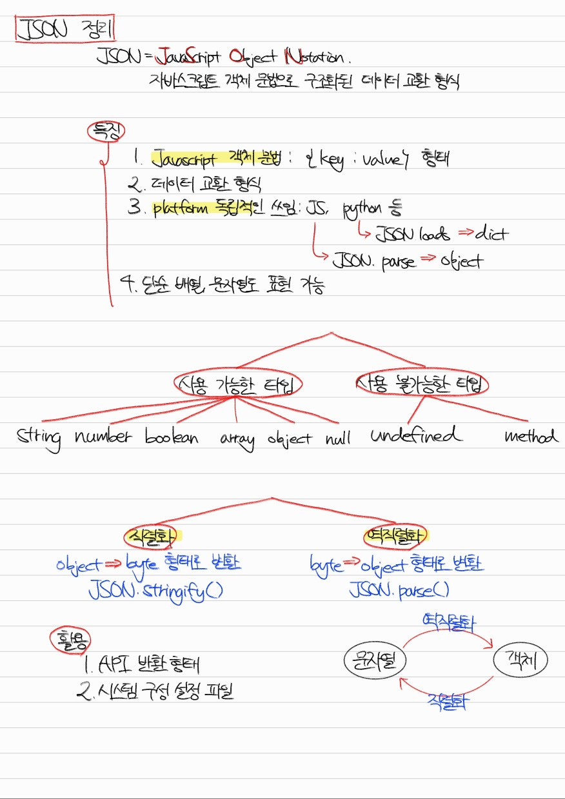
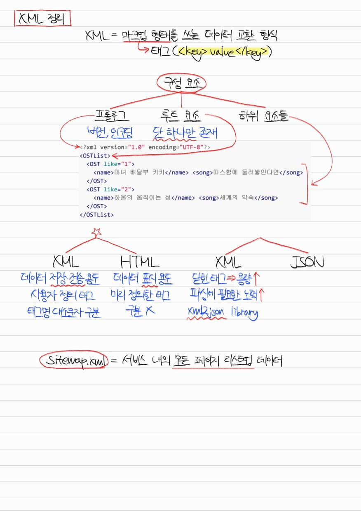

# Section 0. 개발자 필수 지식

## 데이터 교환 형식 # 1. JSON과 역직렬화/직렬화

Q1. JSON에 대해 설명하세요.

JSON은 JavaScript Object Notation의 줄임말로, 자바스크립트 객체 문법을 사용한 데이터 교환 형식을 말합니다.

플랫폼 독립적인 데이터 형식이기 때문에 자바스크립트, 자바, 파이썬 등 다양한 언어와 다양한 시스템에서 사용할 수 있습니다. 그렇기 때문에 API 반환 형식 또는 package.json과 같은 시스템 구성 설정 파일 등에 사용됩니다.

JSON.parse()를 사용하여 역직렬화하고, JSON.stringify()를 사용하여 직렬화할 수 있습니다.

Q2. 직렬화와 역직렬화에 대해 설명하고 그것이 왜 필요한지 설명하세요.

직렬화란 JSON 객체를 바이트 형식으로 변환하는 것을 말합니다. 직렬화는 다양한 플랫폼에서 객체를 불러올 수 있게 하기 위해 사용됩니다.

역직렬화란 바이트 형식을 JSON 객체로 변환하는 것을 말합니다. 역직렬화는 특정 플랫폼에서 객체를 직접 사용할 수 있게 하기 위해 사용됩니다.

## 데이터 교환 형식 # 2. XML

Q1. XML에 대해 설명하세요.

XML이란 태그로 특징되는 마크업 형태를 쓰는 데이터 교환 형식입니다. 키의 이름으로 태그를 정의하고, 시작 태그와 종료 태그 사이에 키의 값을 포함하는 형태입니다.

XML 문서는 버전 및 인코딩 정보를 담고 있는 프롤로그, 단 한 번만 나타나는 루트 요소, 루트 요소 하위에 존재하는 하위 요소들로 구성됩니다.

Q2. XML과 HTML의 차이점에 대해 설명하세요.

XML은 데이터 저장과 전송 용도로 사용되며, 태그를 사용자가 정의하여 사용해야 되고, 태그명이 대소문자를 구분합니다.

반면 HTML은 데이터 표시 용도로 사용되며, 미리 정의된 태그를 사용해야 되고, 태그명이 대소문자를 구분하지 않습니다.

Q3. 데이터 교환 형식으로 XML과 JSON 중 어떤 것이 더 적합할지 논리적으로 설명하세요.

상황에 따라 적합한 선택지는 다를 수 있겠지만, 저라면 JSON을 선택하겠습니다.

그 이유는 XML의 경우 종료 태그가 차지하는 용량 때문에 기본적으로 데이터가 무거워지고, 노드 환경에서 자바스크립트 객체로 파싱할 때에도 내장 라이브러리가 지원되지 않고 xml2json 같은 외부 라이브러리를 사용해야 한다는 불편함이 있기 때문입니다.

