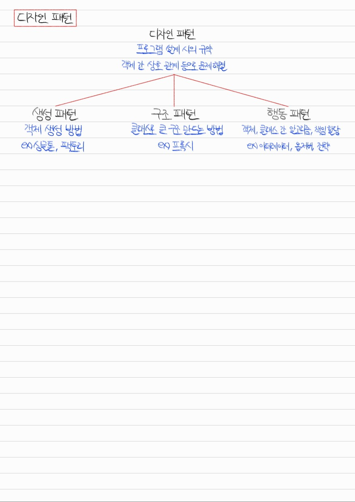
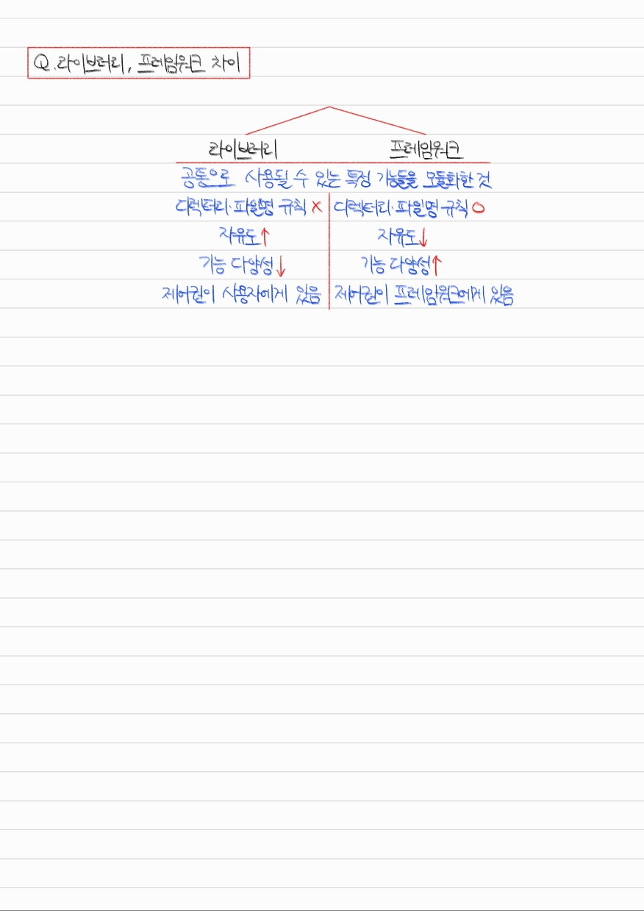
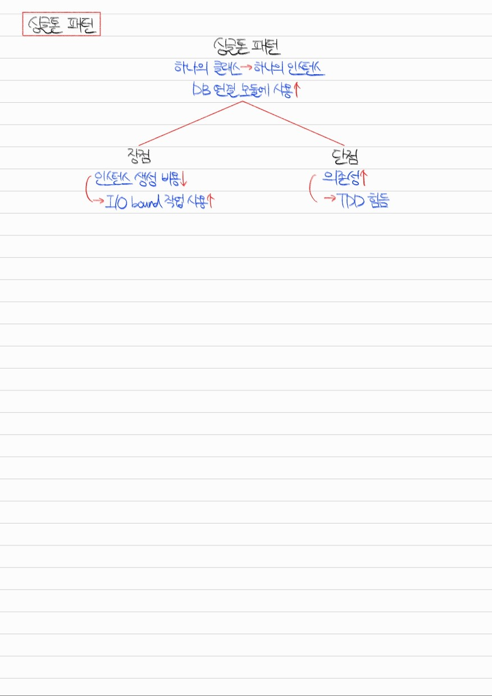

# Section 1. 디자인 패턴

## 디자인패턴 개요



<details>
<summary>Q1. 디자인 패턴에 대해 설명하세요.</summary>

디자인 패턴이란 프로그램 설계 중 발생한 문제들에 대해 객체 간의 관계 등을 이용해 고안해낸 해결 방법입니다. 프로그램 설계 시 하나의 규약으로 사용됩니다.

디자인 패턴에는 생성 패턴, 구조 패턴, 행동 패턴이 있습니다. 생성 패턴은 객체 생성 방법에 관한 것이고, 구조 패턴은 클래스와 객체로 큰 구조를 만드는 방법에 관한 것이며, 행동 패턴은 클래스와 객체 간 알고리즘, 책임 할당 방법에 관한 것입니다.

생성 패턴의 대표적인 예시로는 싱글톤 패턴, 팩토리 패턴이 있습니다. 구조 패턴의 대표적인 예시로는 프록시 패턴이 있습니다. 행동 패턴의 대표적인 예시로는 이터레이터 패턴, 옵저버 패턴, 전략 패턴이 있습니다.

</details>

## 라이브러리와 프레임워크의 차이



<details>
<summary>Q2. 라이브러리와 프레임워크의 공통점과 차이점은 무엇입니까?</summary>

라이브러리와 프레임워크 둘 다 공통적인 기능들을 모듈화한 것이라는 점에서 공통점이 있습니다. 그러나 라이브러리는 디렉터리, 파일명에 대한 규칙이 없어 자유도가 높고 기능이 상대적으로 다양하지 않다는 것이 특징입니다. 반면, 프레임워크는 디렉터리, 파일명에 대한 규칙이 있어 자유도가 낮고 기능이 상대적으로 다양하다는 것이 특징입니다.

이외에도 가장 중요한 특징 중 하나로 라이브러리는 제어권이 사용자에게 있고, 프레임워크는 제어권이 프레임워크에게 역전됩니다.

</details>

## 싱글톤 패턴



**Example) Javascript Non-Singleton Pattern**
```
class NonSingleton {
    constructor() {
        this.name = "yushin";
        this.born = 2001;
        this.height = 165;
    }
}

const obj1 = new NonSingleton();
const obj2 = new NonSingleton();

console.log(obj1 === obj2);

...

$ node nonSingleton.js 
false
```

**Example) Javascript Singleton Pattern**
```
class Singleton {
    constructor() {
        if (!Singleton.instance) {
            Singleton.instance = this;
        }
        return Singleton.instance;
    }

    getInstance() {
        return this;
    }
}

const obj1 = new Singleton();
const obj2 = new Singleton();

console.log(obj1 === obj2);

...

$ node singleton.js 
true
```

<details>
<summary>Q3. 싱글톤 패턴이란 무엇이고, 그 장단점은 무엇입니까?</summary>

싱글톤 패턴은 하나의 클래스가 하나의 인스턴스만 갖는 디자인 패턴입니다. 주로 DB 연결 모듈에 사용됩니다.

싱글톤 패턴의 장점은 인스턴스 생성 비용이 절약된다는 점입니다. 때문에 I/O bound 작업에 많이 사용됩니다. 반면 단점은 의존성이 높다는 것입니다. 때문에 Test-Driven Development 수행 시 순서에 의한 의존성이 생겨 불편함이 생길 수 있습니다.

</details>