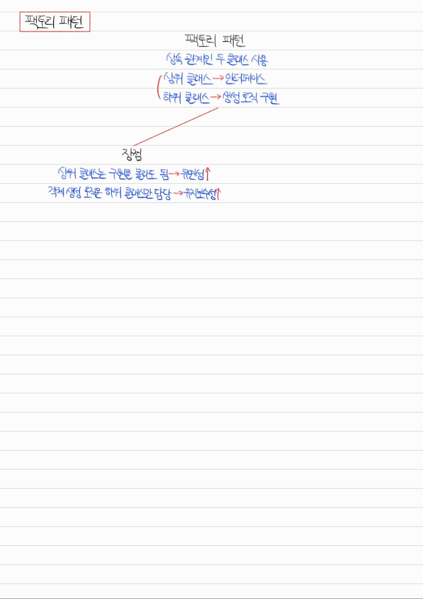
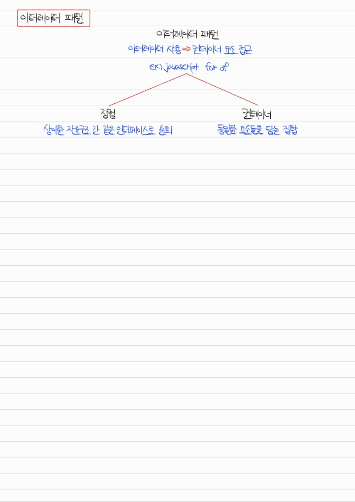
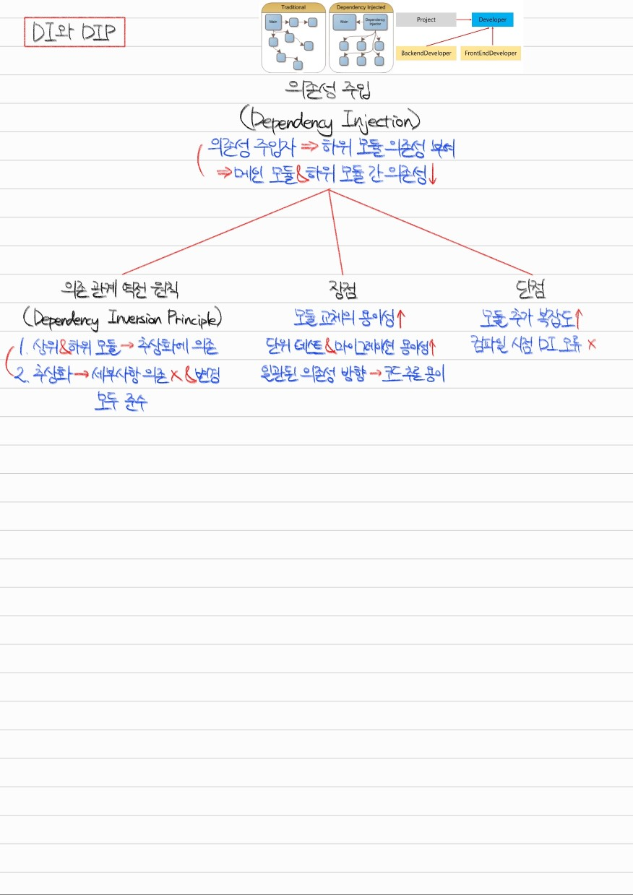
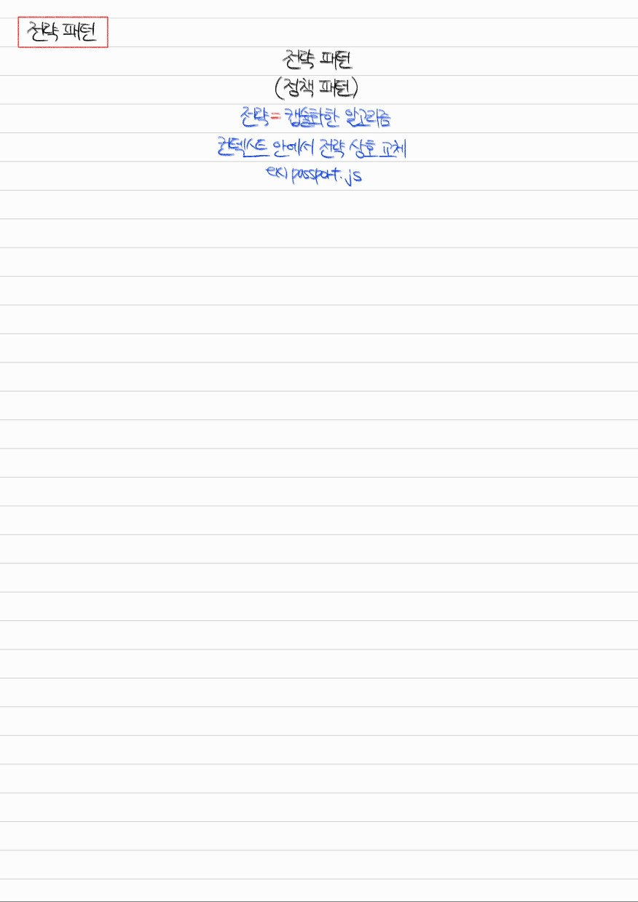

# Section 1. 디자인 패턴

## 디자인패턴 개요


<details>
<summary>Q1. 디자인 패턴에 대해 설명하세요.</summary>

디자인 패턴이란 프로그램 설계 중 발생한 문제들에 대해 객체 간의 관계 등을 이용해 고안해낸 해결 방법입니다. 프로그램 설계 시 하나의 규약으로 사용됩니다.

디자인 패턴에는 생성 패턴, 구조 패턴, 행동 패턴이 있습니다. 생성 패턴은 객체 생성 방법에 관한 것이고, 구조 패턴은 클래스와 객체로 큰 구조를 만드는 방법에 관한 것이며, 행동 패턴은 클래스와 객체 간 알고리즘, 책임 할당 방법에 관한 것입니다.

생성 패턴의 대표적인 예시로는 싱글톤 패턴, 팩토리 패턴이 있습니다. 구조 패턴의 대표적인 예시로는 프록시 패턴이 있습니다. 행동 패턴의 대표적인 예시로는 이터레이터 패턴, 옵저버 패턴, 전략 패턴이 있습니다.

</details>

## 라이브러리와 프레임워크의 차이


<details>
<summary>Q2. 라이브러리와 프레임워크의 공통점과 차이점은 무엇입니까?</summary>

라이브러리와 프레임워크 둘 다 공통적인 기능들을 모듈화한 것이라는 점에서 공통점이 있습니다. 그러나 라이브러리는 디렉터리, 파일명에 대한 규칙이 없어 자유도가 높고 기능이 상대적으로 다양하지 않다는 것이 특징입니다. 반면, 프레임워크는 디렉터리, 파일명에 대한 규칙이 있어 자유도가 낮고 기능이 상대적으로 다양하다는 것이 특징입니다.

이외에도 가장 중요한 특징 중 하나로 라이브러리는 제어권이 사용자에게 있고, 프레임워크는 제어권이 프레임워크에게 역전됩니다.

</details>

## 싱글톤 패턴


**Example) Javascript Non-Singleton Pattern**
```
class NonSingleton {
    constructor() {
        this.name = "yushin";
        this.born = 2001;
        this.height = 165;
    }
}

const obj1 = new NonSingleton();
const obj2 = new NonSingleton();

console.log(obj1 === obj2);

...

$ node nonSingleton.js 
false
```

**Example) Javascript Singleton Pattern**
```
class Singleton {
    constructor() {
        if (!Singleton.instance) {
            Singleton.instance = this;
        }
        return Singleton.instance;
    }

    getInstance() {
        return this;
    }
}

const obj1 = new Singleton();
const obj2 = new Singleton();

console.log(obj1 === obj2);

...

$ node singleton.js 
true
```

<details>
<summary>Q3. 싱글톤 패턴이란 무엇이고, 그 장단점은 무엇입니까?</summary>

싱글톤 패턴은 생성 패턴 중 하나로, 하나의 클래스가 하나의 인스턴스만 갖는 디자인 패턴입니다. 주로 DB 연결 모듈에 사용됩니다.

싱글톤 패턴의 장점은 인스턴스 생성 비용이 절약된다는 점입니다. 때문에 I/O bound 작업에 많이 사용됩니다. 반면 단점은 의존성이 높다는 것입니다. 때문에 Test-Driven Development 수행 시 순서에 의한 의존성이 생겨 불편함이 생길 수 있습니다.

</details>

## 팩토리 패턴



**Example) Javascript Factory Pattern**
```
class CoffeeFactory {
    static createCoffee(type) {
        const factory = factoryList[type];
        return factory.createCoffee();
    }
}

class Latte {
    constructor() {
        this.name = "latte";
    }
}

class Espresso {
    constructor() {
        this.name = "espresso";
    }
}

class LatteFactory extends CoffeeFactory {
    static createCoffee() {
        return new Latte();
    }
}

class EspressoFactory extends CoffeeFactory {
    static createCoffee() {
        return new Espresso();
    }
}

const factoryList = { LatteFactory, EspressoFactory };

const coffee = CoffeeFactory.createCoffee("LatteFactory");
console.log(coffee.name);
```

<details>
<summary>Q4. 팩토리 패턴이란 무엇이고, 장점은 무엇입니까?</summary>

팩토리 패턴은 생성 패턴 중 하나로, 상속 관계에 있는 클래스 중 상위 클래스는 구조를 명시하는 인터페이스의 역할을 하고 하위 클래스는 객체 생성 로직을 직접 구현하는 역할을 하는 디자인 패턴입니다.

팩토리 패턴을 사용하면 상위 클래스는 구현과 독립적이게 되기 때문에 유연성이 증가하고, 객체 생성 로직을 하위 클래스만 담당함으로써 유지보수성이 올라간다는 장점이 있습니다.

</details>

## 이터레이터 패턴



<details>
<summary>Q5. 이터레이터 패턴이란 무엇이고, 장점은 무엇입니까?</summary>

이터레이터 패턴은 행동 패턴 중 하나로, 이터레이터를 사용하여 컨테이너의 요소에 접근하는 디자인 패턴입니다. 대표적인 예시로 Javascript의 for of 문이 있습니다.

상이한 자료구조 간 하나의 인터페이스로 요소를 순회할 수 있어 편이하다는 것이 장점입니다.

</details>

## DI와 DIP



<details>
<summary>Q6. DI란 무엇입니까?</summary>

의존성 주입이란 의존성 주입자가 메인 모듈을 대신하여 하위 모듈에 대한 의존성을 부여하는 것입니다. 이렇게 함으로써 메인 모듈과 하위 모듈 간 의존성이 감소하게 됩니다. 의존성 주입 시에는 의존 관계 역전 원칙(Dependency Inversion Principle)을 준수해야 합니다. 이는 상위 모듈과 하위 모듈이 서로 간에 의존하지 않고 추상화에 의존할 것, 추상화는 세부사항에 의존하지 않고 세부사항이 추상화에 의해 변경되게 할 것 두 가지를 준수하는 것입니다.

</details>

<details>
<summary>Q7. DI의 장단점은 무엇입니까?</summary>

의존성 주입의 장점은 모듈 교체가 용이해진다는 것, 단위 테스트와 마이그레이션이 용이해진다는 것, 프로그램 전체적으로 의존성의 방향이 일관되어 코드 추론이 용이해진다는 것이 있습니다.

반면, 모듈이 추가될수록 프로그램의 복잡도가 올라간다는 것과 의존성 주입 에러가 컴파일 시점에 디버깅되기 어렵다는 단점이 있습니다.

</details>

## 전략 패턴



<details>
<summary>Q8. 전략 패턴이란 무엇입니까?</summary>

전략 패턴은 행동 패턴의 한 종류로, 전략이라는 캡슐화한 알고리즘을 컨텍스트 안에서 상호 교체하는 디자인 패턴입니다. 전략 패턴을 사용한 대표적인 예시로는 passport.js가 있습니다.

</details>