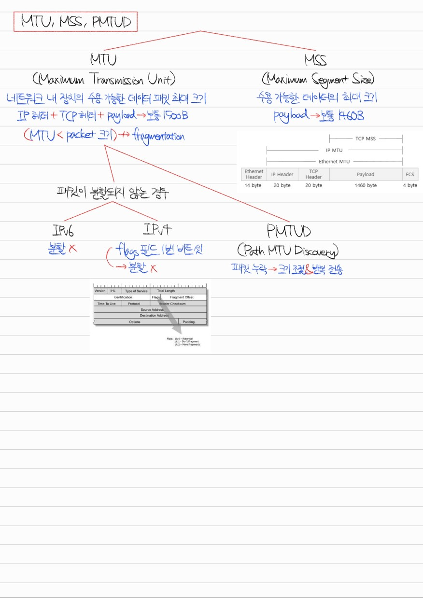

# Section 2. 네트워크

## 네트워크의 기초 #1. 네트워크, 처리량, 트래픽, 대역폭, RTT


<details>
<summary>Q1. 네트워크란 무엇입니까?</summary>

네트워크란 통신 장치를 의미하는 노드, 장치 간 유/무선 연결 매체를 의미하는 링크가 연결되어 자원을 공유하는 집합입니다.

</details>

<details>
<summary>Q2. 트래픽, 처리량, 대역폭은 어떤 개념입니까?</summary>

셋 다 네트워크 내 데이터 흐름에 관련된 개념입니다. 관련된 단위로는 bit per second가 있습니다.

트래픽은 특정 시점에 링크 내 흐르는 데이터의 양, 즉 발생되는 데이터의 누적량을 의미합니다.

처리량은 링크 내에서 성공적으로 전달된 데이터의 양, 즉 트래픽의 처리량을 의미합니다.

대역폭은 특정 기간 내 처리 가능한 트래픽의 양을 의미합니다.

</details>

<details>
<summary>Q3. RTT란 무엇입니까?</summary>

RTT는 Round Trip Time, 왕복 지연시간을 의미합니다. 어떤 데이터를 전송할 때 데이터의 전송 시작 시점부터 수신 확인에 소요되는 시간입니다. 즉, 메시지가 두 장치를 왕복하는 데 걸리는 시간이라고 할 수 있습니다.

</details>

## 네트워크의 기초 #2 ~ #4. 네트워크 토폴로지


<details>
<summary>Q4. 네트워크 토폴로지란 무엇이고, 어떤 것들이 있나요?</summary>

네트워크 토폴로지란 네트워크에서 노드와 링크가 구성된 방식을 의미합니다. 대표적으로 버스 토폴로지, 스타 토폴로지, 트리 토폴로지, 링형 토폴로지, 메시 토폴로지가 있습니다.

버스 토폴로지는 단일 링크 내에 여러 개의 노드가 연결된 구조입니다. 스타 토폴로지는 중심이 되는 노드를 기반으로 여러 개의 노드가 연결된 구조입니다. 트리 토폴로지는 계층형 토폴로지라고도 부르며, 버스 토폴로지와 스타 토폴로지의 하이브리드 형태의 구조입니다. 링형 토폴로지는 고리 형태로 노드들이 토큰 기반으로 통신 권한을 검사하며 통신하는 구조입니다. 메시 토폴로지는 네트워크 내 다수의 노드들이 그물망 형태로 링크를 형성한 구조입니다.

</details>

<details>
<summary>Q5. 네트워크에서 병목 현상이란 무엇이고, 어떻게 해결합니까?</summary>

네트워크에서 병목 현상이란 트래픽이 집중됨에 따라 데이터 흐름이 제한되는 현상을 의미합니다. 병목 현상을 해결하기 위해서 네트워크의 토폴로지 형태를 파악하고 데이터 흐름이 집중되는 링크를 파악하여 분산형으로 바꾸거나, 해당 노드 장비의 하드웨어 스펙을 올려야 합니다.

</details>

## 네트워크의 기초 #5. 유니캐스트, 멀티캐스트, 브로드캐스트


**Socket.IO Example) server.js**
```
const app = require("express")();
const http = require("http").Server(app);
const io = require("socket.io")(http);
const port = process.env.PORT || 3000;

app.get("/", (req, res) => {
    res.sendFile(__dirname + "/index.html");
});

io.on("connection", (socket) => {
    socket.on("chat message", (message) => {
        io.emit("chat message", message);
    });
});

http.listen(port, () => {
    console.log(`Socket.IO server is running at http://localhost:${port}/`);
});
```

**Socket.IO Example) index.html**
```
<!DOCTYPE html>
<html lang="en">
<head>
    <meta charset="UTF-8">
    <meta name="viewport" content="width=device-width, initial-scale=1.0">
    <title>Socket.IO Example</title>
</head>
<body>
    <ul id="messages"></ul>
    <form id="form" action="">
        <input id="input" autocomplete="off"/>
        <button>Send</button>
    </form>

    <script src="/socket.io/socket.io.js"></script>
    <script>
        const socket = io();
        
        const messages = document.getElementById("messages");
        const form = document.getElementById("form");
        const input = document.getElementById("input");

        form.addEventListener("submit", (e) => {
            e.preventDefault();
            if (input.value) {
                socket.emit("chat message", input.value);
                input.value = "";
            }
        });

        socket.on("chat message", (message) => {
            const item = document.createElement("li");
            item.textContent = message;
            messages.appendChild(item);
            window.scrollTo(0, document.body.scrollHeight);
        });
    </script>
</body>
</html>
```

<details>
<summary>Q6. 유니캐스트, 멀티캐스트, 브로드캐스트란 무엇입니까?</summary>

유니캐스트는 1:1 통신으로, 가장 일반적인 형태의 통신 방식입니다. 대표적인 예시로는 HTTP 통신이 있습니다.

멀티캐스트는 1:N 통신으로, 데이터가 특정 그룹에게만 전달되는 형태의 통신 방식입니다.

브로드캐스트는 1:N 통신으로, 데이터가 모든 노드에게 전달되는 형태의 통신 방식입니다. 대표적인 예시로는 ARP가 있습니다.

</details>

## 네트워크의 분류: LAN, MAN, WAN


<details>
<summary>Q7. LAN, MAN, WAN이란 무엇입니까?</summary>

LAN, Local Area Network는 허브 또는 스위치로 연결된 지역적 네트워크입니다. 공유기에 연결된 장치들에게 DHCP로 사설 IP를 부여하고, NAT로 장치들의 MAC 주소를 고유하게 구분합니다. MAN, WAN에 비해 안정성과 속도가 뛰어나다는 특징이 있습니다.

MAN, Metropolitan Area Network는 라우터, 브리지 등으로 연결된 도시 간 네트워크입니다. 2개 이상의 LAN으로 구성됩니다.

WAN, Wide Area Network는 MAN에서 확장하여 더 많은 라우터들로 구성된 국가 간 네트워크입니다. 인터넷이라고도 부릅니다.

</details>

## TCP/IP 4계층 #1. 개념, 캡슐화, 역캡슐화, PDU, OSI 7계층


<details>
<summary>Q8. TCP/IP 4계층에는 어떤 것들이 있고, 각 계층의 역할은 무엇입니까?</summary>

TCP/IP 4계층은 애플리케이션 계층, 트랜스포트 계층, 인터넷 계층, 네트워크 액세스 계층으로 구성됩니다.

애플리케이션 계층에서는 실질적인 서비스를 사용자에게 제공하며, 대표적인 프로토콜로는 HTTP, FTP, SMTP, SSH가 있습니다. Protocol Data Unit은 메시지입니다.

트랜스포트 계층에서는 애플리케이션 계층에서 전달받은 메시지를 데이터그램화 또는 세그먼트화하고 이들이 오류 없이 순서대로 전송되는 것을 보장하는 역할을 합니다. 대표적인 프로토콜로는 TCP, UDP가 있습니다. Protocol Data Unit은 세그먼트 또는 데이터그램입니다.

인터넷 계층에서는 트랜스포트 계층에서 전달받은 세그먼트 또는 데이터그램을 패킷화하여 목적지로 전송하는 역할을 합니다. 대표적인 프로토콜로는 IP, ARP, ICMP가 있습니다. Protocol Data Unit은 패킷입니다.

네트워크 액세스 계층에서는 인터넷 계층에서 전달받은 패킷을 유/무선으로 물리적 전송하는 역할을 합니다. 데이터 링크 계층과 물리 계층이 합쳐진 형태로, Protocol Data Unit은 데이터 링크 계층의 경우 프레임, 물리 계층의 경우 비트입니다.

</details>

<details>
<summary>Q9. 캡슐화와 역캡슐화에 대해 설명하세요.</summary>

캡슐화는 애플리케이션 계층부터 물리 계층까지 내려가며 데이터에 독립적인 헤더들을 붙여 나가는 과정입니다. 애플리케이션 계층에서 메시지였던 것이 TCP 헤더, IP 헤더, CRC/Checksum 등이 추가되면서 캡슐화됩니다. 이는 송신자가 수신자에게 데이터를 전송하는 상황에 일어납니다.

역캡슐화는 물리 계층부터 애플리케이션 계층까지 올라가며 데이터의 독립적인 헤더들을 떼어 나가는 과정입니다. CRC에서 전송 오류를 감지, Checksum에서 데이터 무결성을 검사한 후 IP 헤더에서 목적지 주소 등의 정보를 확인하고 TCP 헤더에서 오류 검사 및 순서 검사 등을 하면서 최종적으로 애플리케이션 계층에 도달하면 수신자에게 메시지 전달이 성공합니다. 이는 수신자가 데이터를 수신하는 상황에 일어납니다.

</details>

<details>
<summary>Q10. OSI 7계층과 TCP/IP 4계층의 차이점은 무엇입니까?</summary>

OSI는 애플리케이션, 프레젠테이션, 세션 계층이 TCP/IP에서의 애플리케이션 계층과 동일합니다. 트랜스포트 계층은 동일합니다. OSI의 네트워크 계층은 TCP/IP에서의 인터넷 계층과 동일합니다. OSI의 데이터 링크, 물리 계층은 TCP/IP에서의 네트워크 액세스 계층과 동일합니다.

</details>

## TCP/IP 4계층 #2. MTU, MSS, PMTUD



<details>
<summary>Q11. MTU와 MSS에 대해 설명하고, 어떤 차이점이 있는지 설명하세요.</summary>

MTU는 Maximum Tranmission Unit으로, 네트워크 내에 있는 장치가 수용 가능한 데이터 패킷의 최대 크기를 의미합니다. 여기서 데이터 패킷의 크기는 TCP 헤더의 크기, IP 헤더의 크기, Payload의 크기를 모두 합한 것입니다.

MSS는 Maximum Segment Size로, 네트워크 내에 있는 장치가 수용 가능한 데이터의 최대 크기를 의미합니다. 여기서 데이터의 크기는 Payload만의 크기를 의미합니다.

통상 MTU는 1,500 바이트입니다. 그리고 TCP 헤더와 IP 헤더가 각각 20 바이트를 차지하기 때문에 MSS는 통상 1,460 바이트입니다.

</details>

<details>
<summary>Q12. MTU보다 큰 데이터를 보내면 어떤 일이 일어나나요?</summary>

MTU보다 큰 데이터를 전송하면 데이터가 Segmentation될 수 있습니다. 언제나 일어나는 것은 아닙니다. 예를 들어 IPv6은 기본적으로 Segmentation을 허용하지 않고, IPv4는 IP 헤더의 flags 필드에서 Don't fragment를 의미하는 1번 비트가 설정되어 있으면 Segmentation이 허용되지 않습니다.

Segmentation이 허용되지 않으면 패킷 전송에 실패하기 때문에 송신자는 PMTUD, Path MTU Discovery를 통해서 중간에 패킷이 누락된 경우 패킷의 크기를 줄여가며 반복 전송하면서 MTU 이하의 크기를 갖는 데이터를 전송할 수 있습니다.

</details>

## TCP/IP 4계층 #3. 애플리케이션 계층


<details>
<summary>Q13. TCP/IP 4계층에서 애플리케이션 계층과 대표적인 프로토콜들에 대해 설명하세요.</summary>

TCP/IP 4계층에서 애플리케이션 계층은 사용자에게 실질적인 서비스를 제공합니다. 대표적인 프로토콜로는 HTTP, SSH, FTP, SMTP가 있습니다.

HTTP, Hypertext Transfer Protocol은 원래 서버와 브라우저 간의 통신을 위한 프로토콜이었습니다. 그러나 현재는 서버와 서버 간의 통신에도 사용되고 있습니다. 주요한 특징으로는 헤더를 통한 확장이 용이하다는 점, 무상태여서 서로 다른 요청 간에 상태를 공유하지 않는다는 점이 있습니다.

SSH, Secure Shell Protocol은 보안되지 않은 네트워크 내 안전한 통신을 위한 암호화 네트워크 프로토콜입니다. CLI 환경에서 사용되며 SCP를 사용하면 SSH를 사용해 파일 전송도 할 수 있습니다.

FTP, File Transfer Protocol은 노드들 간 파일 전송을 위한 프로토콜입니다. FileZilla와 같이 GUI 형태로도 제공됩니다. 현재는 SFTP 또는 FTPS라는 암호화된 파일 전송 프로토콜로 대체되고 있습니다.

SMTP, Simple Mail Transfer Protocol은 메일 전송에 사용되는 프로토콜입니다. Node.js에서는 Nodemailer라는 라이브러리를 사용해 SMTP 프로토콜로 메일링을 할 수 있습니다.

</details>

## TCP/IP 4계층 #4. 전송 계층


<details>
<summary>Q14. TCP/IP 4계층에서 전송 계층과 대표적인 프로토콜들에 대해 설명하세요.</summary>

TCP/IP 4계층에서 전송 계층은 애플리케이션 계층의 메시지를 세그먼트 또는 데이터그램으로 만드는 역할을 담당합니다. 대표적인 프로토콜로는 TCP, UDP가 있습니다.

TCP는 가상 회선 패킷 교환 방식을 통해 회선 기반으로 데이터의 순서를 보장합니다. 오류 검사 메커니즘으로는 timeout 발생 시 재전송 또는 Checksum을 사용합니다. 헤더는 20바이트에서 60바이트 사이의 가변 길이를 가집니다.

UDP는 데이터그램 패킷 교환 방식을 통해 순서를 보장하지 않고 데이터를 전송합니다. 오류 검사 메커니즘으로는 간단한 Checksum만을 사용합니다. 헤더는 8바이트의 고정 길이를 가집니다.

</details>

<details>
<summary>Q15. TCP와 UDP의 차이점이 무엇인가요?</summary>

TCP는 가상 회선 패킷 교환 방식, 신뢰성, 재전송 및 Checksum 오류 검사, 가변 헤더 길이, handshake를 통한 연결성, 브로드캐스트 미지원, 느린 속도의 특징을 갖고 있습니다.

UDP는 데이터그램 패킷 교환 방식, 비신뢰성, Checksum 오류 검사, 고정 헤더 길이, 비연결성, 브로드캐스트 지원, 빠른 속도의 특징을 갖고 있습니다.

</details>

## TCP/IP 4계층 #5. 인터넷 계층


<details>
<summary>Q16. TCP/IP 4계층에서 인터넷 계층과 대표적인 프로토콜에 대해 설명하세요.</summary>

TCP/IP 4계층에서 인터넷 계층은 전송 계층의 세그먼트 또는 데이터그램을 패킷으로 만드는 역할을 합니다. 대표적인 프로토콜로는 ICMP가 있습니다.

ICMP, Internet Control Message Protocol은 노드 간 통신이 원활히 되고 있는지 확인하기 위한 프로토콜입니다. 데이터 교환이 불가능하고 테스팅 용도로 사용됩니다. 전송 계층과 연관이 없는 인터넷 계층만의 독립적인 비연결형 프로토콜입니다. Ping 커맨드가 ICMP를 사용해 구현되었습니다.

</details>

## TCP의 연결 성립: 3-Way Handshake


<details>
<summary>Q17. TCP 3-way handshake에 대해 설명하세요.</summary>

TCP 3-way handshake는 TCP 연결 성립 과정입니다. SYN 단계, SYN+ACK 단계, ACK 단계의 3단계로 나뉩니다.

SYN 단계에선 클라이언트가 ISN을 생성하고 서버에 연결 요청을 보냅니다. 이때 서버는 CLOSED 상태에서 LISTEN 상태로 전환되어 있어야 하며, 클라이언트는 CLOSED 상태에서 SYN-SENT 상태로 전환됩니다.

SYN+ACK 단계에선 서버가 클라이언트의 ISN에 1을 더해 연결 요청을 승인하고, 자신의 ISN을 생성한 후 클라이언트에게 연결 요청을 보냅니다. 이때 서버는 LISTEN 상태에서 SYN-RECEIVED 상태로 전환됩니다.

ACK 단계에선 클라이언트가 서버의 ISN에 1을 더해 연결 요청을 승인하고 TCP 연결이 성립됩니다. 이때 클라이언트는 ESTABLISHED 상태가 되고, 서버는 ACK을 받고 ESTABLISHED 상태가 됩니다.

</details>

<details>
<summary>Q18. ISN이란 무엇이고 어떤 역할을 하나요?</summary>

ISN이란 TCP 기반의 통신에서 새 연결에 할당되는 32비트의 고유한 시퀀스입니다. 고유한 값을 가지기 때문에 연결 간 데이터가 구분될 수 있어 충돌이 방지됩니다.

</details>

## TCP의 연결 해제: 4-Way Handshake


<details>
<summary>Q19. TCP 4-way handshake에 대해 설명하세요.</summary>

TCP 4-way handshake는 TCP 연결 해제 과정입니다. 클라이언트 FIN 단계, ACK 단계, 서버 FIN 단계, ACK 단계의 4단계로 구성됩니다.

클라이언트 FIN 단계에서는 클라이언트가 종료를 요청합니다. 이때 클라이언트는 ESTABLISHED 상태에서 FIN_WAIT_1 상태로 전환됩니다.

ACK 단계에서는 서버가 클라이언트의 종료 요청을 승인합니다. 이때 서버는 ESTABLISHED 상태에서 CLOSE_WAIT 상태로 전환되고, 클라이언트는 ACK 패킷을 받은 후 FIN_WAIT_2 상태로 전환됩니다.

서버의 FIN 단계에서는 서버가 종료를 요청합니다. 이때 서버는 LAST_ACK 상태로 전환되어 클라이언트의 마지막 ACK를 기다립니다.

ACK 단계에서는 클라이언트가 서버의 종료 요청을 승인합니다. 이때 클라이언트는 TIME_WAIT 상태에서 대기하다가 CLOSED 상태로 전환되고, 서버는 ACK 패킷을 받으면 CLOSED 상태로 전환됩니다.

</details>

<details>
<summary>Q20. TIME_WAIT 상태가 무엇인가요?</summary>

TCP 4-way handshake에서 클라이언트가 마지막으로 ACK 요청을 보낸 후 서버의 지연 패킷을 대기하는 상태입니다. 일반적으로 OS dependent한 최대 패킷 수명(MSL)의 두 배 정도의 시간을 가집니다.

TIME_WAIT 상태를 가짐으로써 데이터 무결성을 보장할 수 있고, 연결을 올바르게 해제할 수 있습니다.

</details>

<details>
<summary>Q21. TCP 연결 종료 과정은 왜 3-way가 아닌 4-way일까요?</summary>

TCP 연결 성립 과정에서 서버는 SYN 패킷을 받은 이후 ACK 패킷과 자신의 SYN 패킷을 분할해 전송할 이유가 없습니다. 때문에 3-way handshake에선 두 전송이 동시에 이루어집니다.

그러나 TCP 연결 종료 과정에서 서버는 FIN 패킷을 받은 이후에도 데이터를 전송해야 할 수 있습니다. 따라서 ACK 패킷을 우선 보낸 후 자신의 FIN 패킷은 데이터 전송을 마친 뒤에 보내야 합니다.

즉, 서버의 ACK 패킷과 FIN 패킷은 항상 동시에 전송될 수 없습니다. 따라서 이 두 전송 과정을 분리하여 4-way handshake가 형성된 것입니다.

</details>

## 라우팅 #1. 개념과 라우터


<details>
<summary>Q22. 라우팅과 라우터에 대해 설명하세요.</summary>

라우팅이란 네트워크 내에서 데이터를 전송할 때 송신자와 수신자 간 최적의 경로를 결정하는 과정을 의미합니다. hop-by-hop 통신이라고도 부릅니다.

라우터란 네트워크 간 데이터를 전송하기 위한 장치로, 라우팅 테이블을 기반으로 라우팅을 수행합니다. 보통 2개 이상의 네트워크가 연결됩니다.

</details>

## 라우팅 #2. 라우팅 테이블


<details>
<summary>Q23. 라우팅 테이블이란 무엇이고, 어떤 정보들로 구성되어 있나요?</summary>

라우팅 테이블이란 IP 주소를 기반으로 연결된 라우터들의 위치로 향하는 방법을 저장해둔 테이블 또는 데이터베이스입니다.

라우팅 테이블의 구성 요소로는 목적지 주소, 서브넷 마스크, 게이트웨이 주소, 인터페이스, 우선순위를 나타내는 메트릭이 있습니다. 메트릭의 값은 주로 hop count, 지연 시간, 처리량 등으로 결정됩니다.

</details>

## IP 주소, MAC 주소, ARP, RARP


<details>
<summary>Q24. IP 주소와 MAC 주소의 차이점은 무엇인가요?</summary>

IP 주소는 논리적 주소라고도 부르며, 같은 장치라도 연결된 네트워크에 따라 달라질 수 있는 주소입니다. MAC 주소는 물리적 주소라고도 부르며, 같은 장치라면 같은 값을 가지는 고유한 주소입니다. IP 주소는 공유기가 DHCP를 통해 할당하지만 MAC 주소는 NIC 제조사에서 하드웨어 생산 시 할당합니다.

</details>

<details>
<summary>Q25. ARP에 대해 설명하세요.</summary>

ARP, Address Resolution Protocol이란 IP 주소를 MAC 주소로 변환하는 과정입니다. 네트워크에서 실제 장치 간 통신이 일어나기 위해선 IP 주소만으로 부족하고, 해당 장치의 MAC 주소가 있어야 합니다. 이때 ARP를 사용해 MAC 주소를 알아내고 이를 기반으로 실제 물리적 통신이 일어나게 됩니다.

ARP는 두 개의 과정으로 구성됩니다. 첫 번째로, 네트워크 내의 모든 장치에게 MAC 주소를 찾고 있다는 요청을 브로드캐스트합니다. 두 번째로, 네트워크 내에 해당 MAC 주소를 가진 장치가 존재한다면 해당 장치가 응답을 유니캐스트합니다.

</details>