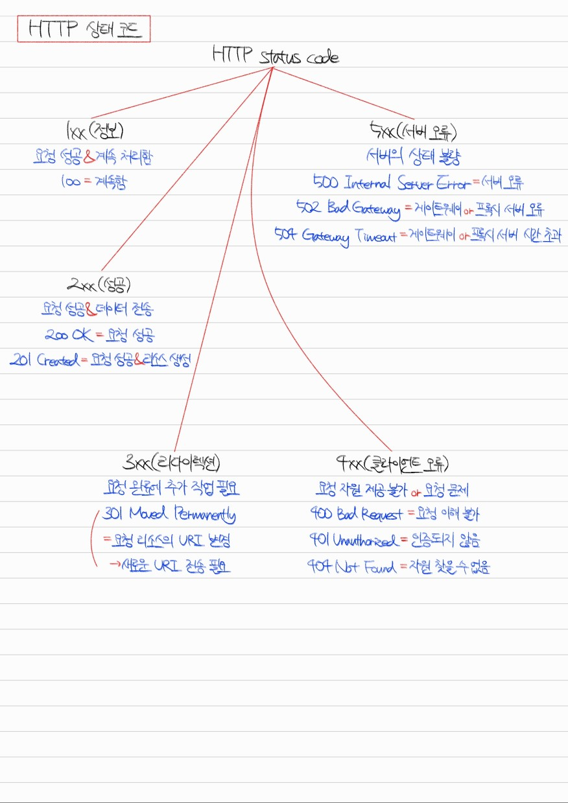
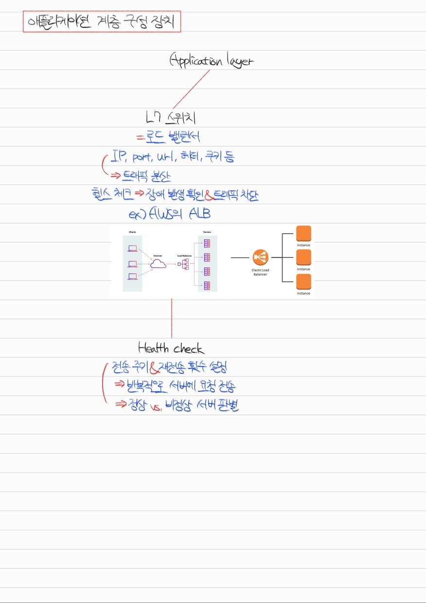

# Section 2. 네트워크

## 네트워크의 기초 #1. 네트워크, 처리량, 트래픽, 대역폭, RTT


<details>
<summary>Q1. 네트워크란 무엇입니까?</summary>

네트워크란 통신 장치를 의미하는 노드, 장치 간 유/무선 연결 매체를 의미하는 링크가 연결되어 자원을 공유하는 집합입니다.

</details>

<details>
<summary>Q2. 트래픽, 처리량, 대역폭은 어떤 개념입니까?</summary>

셋 다 네트워크 내 데이터 흐름에 관련된 개념입니다. 관련된 단위로는 bit per second가 있습니다.

트래픽은 특정 시점에 링크 내 흐르는 데이터의 양, 즉 발생되는 데이터의 누적량을 의미합니다.

처리량은 링크 내에서 성공적으로 전달된 데이터의 양, 즉 트래픽의 처리량을 의미합니다.

대역폭은 특정 기간 내 처리 가능한 트래픽의 양을 의미합니다.

</details>

<details>
<summary>Q3. RTT란 무엇입니까?</summary>

RTT는 Round Trip Time, 왕복 지연시간을 의미합니다. 어떤 데이터를 전송할 때 데이터의 전송 시작 시점부터 수신 확인에 소요되는 시간입니다. 즉, 메시지가 두 장치를 왕복하는 데 걸리는 시간이라고 할 수 있습니다.

</details>

## 네트워크의 기초 #2 ~ #4. 네트워크 토폴로지


<details>
<summary>Q4. 네트워크 토폴로지란 무엇이고, 어떤 것들이 있나요?</summary>

네트워크 토폴로지란 네트워크에서 노드와 링크가 구성된 방식을 의미합니다. 대표적으로 버스 토폴로지, 스타 토폴로지, 트리 토폴로지, 링형 토폴로지, 메시 토폴로지가 있습니다.

버스 토폴로지는 단일 링크 내에 여러 개의 노드가 연결된 구조입니다. 스타 토폴로지는 중심이 되는 노드를 기반으로 여러 개의 노드가 연결된 구조입니다. 트리 토폴로지는 계층형 토폴로지라고도 부르며, 버스 토폴로지와 스타 토폴로지의 하이브리드 형태의 구조입니다. 링형 토폴로지는 고리 형태로 노드들이 토큰 기반으로 통신 권한을 검사하며 통신하는 구조입니다. 메시 토폴로지는 네트워크 내 다수의 노드들이 그물망 형태로 링크를 형성한 구조입니다.

</details>

<details>
<summary>Q5. 네트워크에서 병목 현상이란 무엇이고, 어떻게 해결합니까?</summary>

네트워크에서 병목 현상이란 트래픽이 집중됨에 따라 데이터 흐름이 제한되는 현상을 의미합니다. 병목 현상을 해결하기 위해서 네트워크의 토폴로지 형태를 파악하고 데이터 흐름이 집중되는 링크를 파악하여 분산형으로 바꾸거나, 해당 노드 장비의 하드웨어 스펙을 올려야 합니다.

</details>

## 네트워크의 기초 #5. 유니캐스트, 멀티캐스트, 브로드캐스트


**Socket.IO Example) server.js**
```
const app = require("express")();
const http = require("http").Server(app);
const io = require("socket.io")(http);
const port = process.env.PORT || 3000;

app.get("/", (req, res) => {
    res.sendFile(__dirname + "/index.html");
});

io.on("connection", (socket) => {
    socket.on("chat message", (message) => {
        io.emit("chat message", message);
    });
});

http.listen(port, () => {
    console.log(`Socket.IO server is running at http://localhost:${port}/`);
});
```

**Socket.IO Example) index.html**
```
<!DOCTYPE html>
<html lang="en">
<head>
    <meta charset="UTF-8">
    <meta name="viewport" content="width=device-width, initial-scale=1.0">
    <title>Socket.IO Example</title>
</head>
<body>
    <ul id="messages"></ul>
    <form id="form" action="">
        <input id="input" autocomplete="off"/>
        <button>Send</button>
    </form>

    <script src="/socket.io/socket.io.js"></script>
    <script>
        const socket = io();
        
        const messages = document.getElementById("messages");
        const form = document.getElementById("form");
        const input = document.getElementById("input");

        form.addEventListener("submit", (e) => {
            e.preventDefault();
            if (input.value) {
                socket.emit("chat message", input.value);
                input.value = "";
            }
        });

        socket.on("chat message", (message) => {
            const item = document.createElement("li");
            item.textContent = message;
            messages.appendChild(item);
            window.scrollTo(0, document.body.scrollHeight);
        });
    </script>
</body>
</html>
```

<details>
<summary>Q6. 유니캐스트, 멀티캐스트, 브로드캐스트란 무엇입니까?</summary>

유니캐스트는 1:1 통신으로, 가장 일반적인 형태의 통신 방식입니다. 대표적인 예시로는 HTTP 통신이 있습니다.

멀티캐스트는 1:N 통신으로, 데이터가 특정 그룹에게만 전달되는 형태의 통신 방식입니다.

브로드캐스트는 1:N 통신으로, 데이터가 모든 노드에게 전달되는 형태의 통신 방식입니다. 대표적인 예시로는 ARP가 있습니다.

</details>

## 네트워크의 분류: LAN, MAN, WAN


<details>
<summary>Q7. LAN, MAN, WAN이란 무엇입니까?</summary>

LAN, Local Area Network는 허브 또는 스위치로 연결된 지역적 네트워크입니다. 공유기에 연결된 장치들에게 DHCP로 사설 IP를 부여하고, NAT로 장치들의 MAC 주소를 고유하게 구분합니다. MAN, WAN에 비해 안정성과 속도가 뛰어나다는 특징이 있습니다.

MAN, Metropolitan Area Network는 라우터, 브리지 등으로 연결된 도시 간 네트워크입니다. 2개 이상의 LAN으로 구성됩니다.

WAN, Wide Area Network는 MAN에서 확장하여 더 많은 라우터들로 구성된 국가 간 네트워크입니다. 인터넷이라고도 부릅니다.

</details>

## TCP/IP 4계층 #1. 개념, 캡슐화, 역캡슐화, PDU, OSI 7계층


<details>
<summary>Q8. TCP/IP 4계층에는 어떤 것들이 있고, 각 계층의 역할은 무엇입니까?</summary>

TCP/IP 4계층은 애플리케이션 계층, 트랜스포트 계층, 인터넷 계층, 네트워크 액세스 계층으로 구성됩니다.

애플리케이션 계층에서는 실질적인 서비스를 사용자에게 제공하며, 대표적인 프로토콜로는 HTTP, FTP, SMTP, SSH가 있습니다. Protocol Data Unit은 메시지입니다.

트랜스포트 계층에서는 애플리케이션 계층에서 전달받은 메시지를 데이터그램화 또는 세그먼트화하고 이들이 오류 없이 순서대로 전송되는 것을 보장하는 역할을 합니다. 대표적인 프로토콜로는 TCP, UDP가 있습니다. Protocol Data Unit은 세그먼트 또는 데이터그램입니다.

인터넷 계층에서는 트랜스포트 계층에서 전달받은 세그먼트 또는 데이터그램을 패킷화하여 목적지로 전송하는 역할을 합니다. 대표적인 프로토콜로는 IP, ARP, ICMP가 있습니다. Protocol Data Unit은 패킷입니다.

네트워크 액세스 계층에서는 인터넷 계층에서 전달받은 패킷을 유/무선으로 물리적 전송하는 역할을 합니다. 데이터 링크 계층과 물리 계층이 합쳐진 형태로, Protocol Data Unit은 데이터 링크 계층의 경우 프레임, 물리 계층의 경우 비트입니다.

</details>

<details>
<summary>Q9. 캡슐화와 역캡슐화에 대해 설명하세요.</summary>

캡슐화는 애플리케이션 계층부터 물리 계층까지 내려가며 데이터에 독립적인 헤더들을 붙여 나가는 과정입니다. 애플리케이션 계층에서 메시지였던 것이 TCP 헤더, IP 헤더, CRC/Checksum 등이 추가되면서 캡슐화됩니다. 이는 송신자가 수신자에게 데이터를 전송하는 상황에 일어납니다.

역캡슐화는 물리 계층부터 애플리케이션 계층까지 올라가며 데이터의 독립적인 헤더들을 떼어 나가는 과정입니다. CRC에서 전송 오류를 감지, Checksum에서 데이터 무결성을 검사한 후 IP 헤더에서 목적지 주소 등의 정보를 확인하고 TCP 헤더에서 오류 검사 및 순서 검사 등을 하면서 최종적으로 애플리케이션 계층에 도달하면 수신자에게 메시지 전달이 성공합니다. 이는 수신자가 데이터를 수신하는 상황에 일어납니다.

</details>

<details>
<summary>Q10. OSI 7계층과 TCP/IP 4계층의 차이점은 무엇입니까?</summary>

OSI는 애플리케이션, 프레젠테이션, 세션 계층이 TCP/IP에서의 애플리케이션 계층과 동일합니다. 트랜스포트 계층은 동일합니다. OSI의 네트워크 계층은 TCP/IP에서의 인터넷 계층과 동일합니다. OSI의 데이터 링크, 물리 계층은 TCP/IP에서의 네트워크 액세스 계층과 동일합니다.

</details>

## TCP/IP 4계층 #2. MTU, MSS, PMTUD


<details>
<summary>Q11. MTU와 MSS에 대해 설명하고, 어떤 차이점이 있는지 설명하세요.</summary>

MTU는 Maximum Tranmission Unit으로, 네트워크 내에 있는 장치가 수용 가능한 데이터 패킷의 최대 크기를 의미합니다. 여기서 데이터 패킷의 크기는 TCP 헤더의 크기, IP 헤더의 크기, Payload의 크기를 모두 합한 것입니다.

MSS는 Maximum Segment Size로, 네트워크 내에 있는 장치가 수용 가능한 데이터의 최대 크기를 의미합니다. 여기서 데이터의 크기는 Payload만의 크기를 의미합니다.

통상 MTU는 1,500 바이트입니다. 그리고 TCP 헤더와 IP 헤더가 각각 20 바이트를 차지하기 때문에 MSS는 통상 1,460 바이트입니다.

</details>

<details>
<summary>Q12. MTU보다 큰 데이터를 보내면 어떤 일이 일어나나요?</summary>

MTU보다 큰 데이터를 전송하면 데이터가 Segmentation될 수 있습니다. 언제나 일어나는 것은 아닙니다. 예를 들어 IPv6은 기본적으로 Segmentation을 허용하지 않고, IPv4는 IP 헤더의 flags 필드에서 Don't fragment를 의미하는 1번 비트가 설정되어 있으면 Segmentation이 허용되지 않습니다.

Segmentation이 허용되지 않으면 패킷 전송에 실패하기 때문에 송신자는 PMTUD, Path MTU Discovery를 통해서 중간에 패킷이 누락된 경우 패킷의 크기를 줄여가며 반복 전송하면서 MTU 이하의 크기를 갖는 데이터를 전송할 수 있습니다.

</details>

## TCP/IP 4계층 #3. 애플리케이션 계층


<details>
<summary>Q13. TCP/IP 4계층에서 애플리케이션 계층과 대표적인 프로토콜들에 대해 설명하세요.</summary>

TCP/IP 4계층에서 애플리케이션 계층은 사용자에게 실질적인 서비스를 제공합니다. 대표적인 프로토콜로는 HTTP, SSH, FTP, SMTP가 있습니다.

HTTP, Hypertext Transfer Protocol은 원래 서버와 브라우저 간의 통신을 위한 프로토콜이었습니다. 그러나 현재는 서버와 서버 간의 통신에도 사용되고 있습니다. 주요한 특징으로는 헤더를 통한 확장이 용이하다는 점, 무상태여서 서로 다른 요청 간에 상태를 공유하지 않는다는 점이 있습니다.

SSH, Secure Shell Protocol은 보안되지 않은 네트워크 내 안전한 통신을 위한 암호화 네트워크 프로토콜입니다. CLI 환경에서 사용되며 SCP를 사용하면 SSH를 사용해 파일 전송도 할 수 있습니다.

FTP, File Transfer Protocol은 노드들 간 파일 전송을 위한 프로토콜입니다. FileZilla와 같이 GUI 형태로도 제공됩니다. 현재는 SFTP 또는 FTPS라는 암호화된 파일 전송 프로토콜로 대체되고 있습니다.

SMTP, Simple Mail Transfer Protocol은 메일 전송에 사용되는 프로토콜입니다. Node.js에서는 Nodemailer라는 라이브러리를 사용해 SMTP 프로토콜로 메일링을 할 수 있습니다.

</details>

## TCP/IP 4계층 #4. 전송 계층


<details>
<summary>Q14. TCP/IP 4계층에서 전송 계층과 대표적인 프로토콜들에 대해 설명하세요.</summary>

TCP/IP 4계층에서 전송 계층은 애플리케이션 계층의 메시지를 세그먼트 또는 데이터그램으로 만드는 역할을 담당합니다. 대표적인 프로토콜로는 TCP, UDP가 있습니다.

TCP는 가상 회선 패킷 교환 방식을 통해 회선 기반으로 데이터의 순서를 보장합니다. 오류 검사 메커니즘으로는 timeout 발생 시 재전송 또는 Checksum을 사용합니다. 헤더는 20바이트에서 60바이트 사이의 가변 길이를 가집니다.

UDP는 데이터그램 패킷 교환 방식을 통해 순서를 보장하지 않고 데이터를 전송합니다. 오류 검사 메커니즘으로는 간단한 Checksum만을 사용합니다. 헤더는 8바이트의 고정 길이를 가집니다.

</details>

<details>
<summary>Q15. TCP와 UDP의 차이점이 무엇인가요?</summary>

TCP는 가상 회선 패킷 교환 방식, 신뢰성, 재전송 및 Checksum 오류 검사, 가변 헤더 길이, handshake를 통한 연결성, 브로드캐스트 미지원, 느린 속도의 특징을 갖고 있습니다.

UDP는 데이터그램 패킷 교환 방식, 비신뢰성, Checksum 오류 검사, 고정 헤더 길이, 비연결성, 브로드캐스트 지원, 빠른 속도의 특징을 갖고 있습니다.

</details>

## TCP/IP 4계층 #5. 인터넷 계층


<details>
<summary>Q16. TCP/IP 4계층에서 인터넷 계층과 대표적인 프로토콜에 대해 설명하세요.</summary>

TCP/IP 4계층에서 인터넷 계층은 전송 계층의 세그먼트 또는 데이터그램을 패킷으로 만드는 역할을 합니다. 대표적인 프로토콜로는 ICMP가 있습니다.

ICMP, Internet Control Message Protocol은 노드 간 통신이 원활히 되고 있는지 확인하기 위한 프로토콜입니다. 데이터 교환이 불가능하고 테스팅 용도로 사용됩니다. 전송 계층과 연관이 없는 인터넷 계층만의 독립적인 비연결형 프로토콜입니다. Ping 커맨드가 ICMP를 사용해 구현되었습니다.

</details>

## TCP의 연결 성립: 3-Way Handshake


<details>
<summary>Q17. TCP 3-way handshake에 대해 설명하세요.</summary>

TCP 3-way handshake는 TCP 연결 성립 과정입니다. SYN 단계, SYN+ACK 단계, ACK 단계의 3단계로 나뉩니다.

SYN 단계에선 클라이언트가 ISN을 생성하고 서버에 연결 요청을 보냅니다. 이때 서버는 CLOSED 상태에서 LISTEN 상태로 전환되어 있어야 하며, 클라이언트는 CLOSED 상태에서 SYN-SENT 상태로 전환됩니다.

SYN+ACK 단계에선 서버가 클라이언트의 ISN에 1을 더해 연결 요청을 승인하고, 자신의 ISN을 생성한 후 클라이언트에게 연결 요청을 보냅니다. 이때 서버는 LISTEN 상태에서 SYN-RECEIVED 상태로 전환됩니다.

ACK 단계에선 클라이언트가 서버의 ISN에 1을 더해 연결 요청을 승인하고 TCP 연결이 성립됩니다. 이때 클라이언트는 ESTABLISHED 상태가 되고, 서버는 ACK을 받고 ESTABLISHED 상태가 됩니다.

</details>

<details>
<summary>Q18. ISN이란 무엇이고 어떤 역할을 하나요?</summary>

ISN이란 TCP 기반의 통신에서 새 연결에 할당되는 32비트의 고유한 시퀀스입니다. 고유한 값을 가지기 때문에 연결 간 데이터가 구분될 수 있어 충돌이 방지됩니다.

</details>

## TCP의 연결 해제: 4-Way Handshake


<details>
<summary>Q19. TCP 4-way handshake에 대해 설명하세요.</summary>

TCP 4-way handshake는 TCP 연결 해제 과정입니다. 클라이언트 FIN 단계, ACK 단계, 서버 FIN 단계, ACK 단계의 4단계로 구성됩니다.

클라이언트 FIN 단계에서는 클라이언트가 종료를 요청합니다. 이때 클라이언트는 ESTABLISHED 상태에서 FIN_WAIT_1 상태로 전환됩니다.

ACK 단계에서는 서버가 클라이언트의 종료 요청을 승인합니다. 이때 서버는 ESTABLISHED 상태에서 CLOSE_WAIT 상태로 전환되고, 클라이언트는 ACK 패킷을 받은 후 FIN_WAIT_2 상태로 전환됩니다.

서버의 FIN 단계에서는 서버가 종료를 요청합니다. 이때 서버는 LAST_ACK 상태로 전환되어 클라이언트의 마지막 ACK를 기다립니다.

ACK 단계에서는 클라이언트가 서버의 종료 요청을 승인합니다. 이때 클라이언트는 TIME_WAIT 상태에서 대기하다가 CLOSED 상태로 전환되고, 서버는 ACK 패킷을 받으면 CLOSED 상태로 전환됩니다.

</details>

<details>
<summary>Q20. TIME_WAIT 상태가 무엇인가요?</summary>

TCP 4-way handshake에서 클라이언트가 마지막으로 ACK 요청을 보낸 후 서버의 지연 패킷을 대기하는 상태입니다. 일반적으로 OS dependent한 최대 패킷 수명(MSL)의 두 배 정도의 시간을 가집니다.

TIME_WAIT 상태를 가짐으로써 데이터 무결성을 보장할 수 있고, 연결을 올바르게 해제할 수 있습니다.

</details>

<details>
<summary>Q21. TCP 연결 종료 과정은 왜 3-way가 아닌 4-way일까요?</summary>

TCP 연결 성립 과정에서 서버는 SYN 패킷을 받은 이후 ACK 패킷과 자신의 SYN 패킷을 분할해 전송할 이유가 없습니다. 때문에 3-way handshake에선 두 전송이 동시에 이루어집니다.

그러나 TCP 연결 종료 과정에서 서버는 FIN 패킷을 받은 이후에도 데이터를 전송해야 할 수 있습니다. 따라서 ACK 패킷을 우선 보낸 후 자신의 FIN 패킷은 데이터 전송을 마친 뒤에 보내야 합니다.

즉, 서버의 ACK 패킷과 FIN 패킷은 항상 동시에 전송될 수 없습니다. 따라서 이 두 전송 과정을 분리하여 4-way handshake가 형성된 것입니다.

</details>

## 라우팅 #1. 개념과 라우터


<details>
<summary>Q22. 라우팅과 라우터에 대해 설명하세요.</summary>

라우팅이란 네트워크 내에서 데이터를 전송할 때 송신자와 수신자 간 최적의 경로를 결정하는 과정을 의미합니다. hop-by-hop 통신이라고도 부릅니다.

라우터란 네트워크 간 데이터를 전송하기 위한 장치로, 라우팅 테이블을 기반으로 라우팅을 수행합니다. 보통 2개 이상의 네트워크가 연결됩니다.

</details>

## 라우팅 #2. 라우팅 테이블


<details>
<summary>Q23. 라우팅 테이블이란 무엇이고, 어떤 정보들로 구성되어 있나요?</summary>

라우팅 테이블이란 IP 주소를 기반으로 연결된 라우터들의 위치로 향하는 방법을 저장해둔 테이블 또는 데이터베이스입니다.

라우팅 테이블의 구성 요소로는 목적지 주소, 서브넷 마스크, 게이트웨이 주소, 인터페이스, 우선순위를 나타내는 메트릭이 있습니다. 메트릭의 값은 주로 hop count, 지연 시간, 처리량 등으로 결정됩니다.

</details>

## IP 주소, MAC 주소, ARP, RARP


<details>
<summary>Q24. IP 주소와 MAC 주소의 차이점은 무엇인가요?</summary>

IP 주소는 논리적 주소라고도 부르며, 같은 장치라도 연결된 네트워크에 따라 달라질 수 있는 주소입니다. MAC 주소는 물리적 주소라고도 부르며, 같은 장치라면 같은 값을 가지는 고유한 주소입니다. IP 주소는 공유기가 DHCP를 통해 할당하지만 MAC 주소는 NIC 제조사에서 하드웨어 생산 시 할당합니다.

</details>

<details>
<summary>Q25. ARP에 대해 설명하세요.</summary>

ARP, Address Resolution Protocol이란 IP 주소를 MAC 주소로 변환하는 과정입니다. 네트워크에서 실제 장치 간 통신이 일어나기 위해선 IP 주소만으로 부족하고, 해당 장치의 MAC 주소가 있어야 합니다. 이때 ARP를 사용해 MAC 주소를 알아내고 이를 기반으로 실제 물리적 통신이 일어나게 됩니다.

ARP는 두 개의 과정으로 구성됩니다. 첫 번째로, 네트워크 내의 모든 장치에게 MAC 주소를 찾고 있다는 요청을 브로드캐스트합니다. 두 번째로, 네트워크 내에 해당 MAC 주소를 가진 장치가 존재한다면 해당 장치가 응답을 유니캐스트합니다.

</details>

## IP 주소 체계 #2. IPv4와 IPv6


<details>
<summary>Q26. IPv4와 IPv6의 차이점은 무엇인가요?</summary>

IPv4는 32비트로 구성된 IP 주소이며, 각각의 옥텟을 10진수로 변환한 후 온점으로 구분된 4개의 청크를 이어 붙여 주소를 표현합니다. 이러한 주소 개수는 불충분하기 때문에 NAT, subnetting 등의 기술로 보완합니다. 또한, IPv4는 헤더가 가변 길이이고, Checksum 필드가 존재하여 CRC 알고리즘을 사용해 인터넷 계층에서 패킷 데이터의 무결성을 보장하며, 패킷의 수명을 나타내는 필드는 TTL 필드라고 명명되었습니다.

IPv6는 128비트로 구성된 IP 주소이며, 16비트씩 8개의 청크로 구분하고, 청크 내에서 각 4비트를 16진수로 변환한 뒤 콜론으로 구분하여 주소를 표현합니다. 표현 가능한 주소 개수가 많기 때문에 NAT, subnetting 등의 기술을 필요로 하지 않습니다. 또한, IPv6는 헤더가 40바이트의 고정 길이이고, 상위 프로토콜인 TCP/UDP가 Checksum을 지원하기 때문에 Checksum 필드가 존재하지 않으며, 패킷의 수명을 나타내는 필드는 Hop limit 필드라고 명명되었습니다. 주의할 점은 UDP의 경우 헤더의 Checksum 필드를 사용할지 말지를 선택할 수 있기 때문에 IPv6과 UDP를 함께 사용하는 상황에선 UDP 헤더의 Checksum 필드를 사용해야 한다는 것입니다.

</details>

<details>
<summary>Q27. IPv4와 IPv6 둘 중 어떤 것이 더 효율적입니까?</summary>

많은 주소를 표현할 수 있으면서 불필요한 헤더 필드를 제거하고 IPsec을 사용해 패킷 데이터의 보안을 강화한 IPv6이 일반적인 상황에서 더 안전하고 빠릅니다.

그러나 헤더의 크기가 고정되기 때문에 IPv4 헤더의 크기가 더 작은 것과 같은 일부 상황에선 IPv6이 IPv4에 비해 느릴 수 있습니다.

</details>

## IP 주소 체계 #3. Classful IP Addressing


<details>
<summary>Q28. IPv4의 Classful IP Addressing에 대해 설명하세요.</summary>

IPv4를 기준으로 Classful IP Addressing이란 4개의 옥텟으로 이루어진 주소에서 앞의 1/2/3 옥텟을 네트워크 주소로, 나머지 옥텟을 호스트 주소로 규정하여 클래스를 구분하고 클래스별로 네트워크의 크기를 구분하는 것을 의미합니다.

앞의 1 옥텟을 네트워크 주소로 사용하는 것을 Class A라고 부릅니다. Class A의 네트워크 주소에서 맨 앞 비트는 0으로 고정되고, 가능한 네트워크 주소의 첫 번째 옥텟은 1 ~ 126으로 고정됩니다. loopback IP인 127과 특수한 목적의 IP인 0은 제외됩니다. 호스트 주소는 뒤의 3개 옥텟을 사용하고, 이 역시 첫 번째 주소는 네트워크의 대표 주소로, 마지막 주소는 브로드캐스트 주소로 사용되기 때문에 네트워크당 (2^24 - 2)개의 호스트 주소를 나타낼 수 있습니다.

앞의 2 옥텟을 네트워크 주소로 사용하는 것을 Class B라고 부릅니다. Class B의 네트워크 주소에서 맨 앞 비트는 10으로 고정되고, 가능한 네트워크 주소의 첫 번째 옥텟은 128 ~ 191으로 고정됩니다. 호스트 주소는 뒤의 2개 옥텟을 사용하기 때문에 네트워크당 (2^16 - 2)개의 호스트 주소를 나타낼 수 있습니다.

앞의 3 옥텟을 네트워크 주소로 사용하는 것을 Class C라고 부릅니다. Class C의 네트워크 주소에서 맨 앞 비트는 110으로 고정되고, 가능한 네트워크 주소의 첫 번째 옥텟은 192 ~ 223으로 고정됩니다. 호스트 주소는 뒤의 1개 옥텟을 사용하기 때문에 네트워크당 (2^8 - 2)개의 호스트 주소를 나타낼 수 있습니다.

</details>

<details>
<summary>Q29. Classful IP Addressing의 단점은 무엇인가요?</summary>

일반적으로 Classful IP Addressing으로 주소를 할당받을 때엔 네트워크에 할당된 호스트 주소의 개수가 필요한 양에 비해 많거나, 부족하여 문제가 생깁니다.

필요한 양보다 할당된 호스트 주소의 개수가 더 많다면 이는 IP 주소의 낭비로 이어져서 문제가 됩니다. 반면, 할당된 호스트 주소의 개수가 더 적다면 이는 서로 다른 IP 주소를 여러 개 할당받아야 하기 때문에 문제가 됩니다.

</details>

## IP 주소 체계 #4. Classless와 Subnet mask, Subnetting


<details>
<summary>Q30. Classless와 Classful IP addressing의 차이점은 무엇인가요?</summary>

Classful IP addressing은 네트워크를 클래스로 구분하고, 네트워크 주소를 IP 주소의 앞 1/2/3 옥텟을 고정적으로 사용해 부여합니다. 이 방식은 많은 네트워크에서 적절한 네트워크 개수를 부여받지 못해 문제점이 발생합니다.

이를 해결하기 위해 Classless IP addressing이 등장했습니다. 이는 서브넷 마스크를 활용해 네트워크 주소를 나타내는 비트, 호스트 주소를 나타내는 비트를 유연하게 구분하고 이에 따라 필요한 개수로 할당된 주소를 서브네팅하여 활용할 수 있습니다.

</details>

<details>
<summary>Q31. 서브넷 마스크는 왜 1과 0이 연속되어 있어야 할까요?</summary>

IP 주소를 표현할 때 서브넷 마스크를 나타내기 위해서 192.0.0.1/28과 같이 맨 뒤에 서브넷 마스크의 1 개수를 나타내곤 합니다. 만약 1과 0이 연속되어 있지 않고 섞여서 위치할 수 있게 된다면 이런 식으로 간단하게 서브넷 마스크를 표현할 수 없을 것입니다.

</details>

## IP 주소 체계 #5. 공인 IP(public IP)와 사설 IP(private IP)와 NAT


<details>
<summary>Q32. public IP, private IP의 차이점에 대해 설명하세요.</summary>

public IP는 외부 네트워크와 통신하기 위한 IP이고, private IP는 내부 네트워크의 장치들을 구분하고 통신하기 위한 IP입니다.

</details>

<details>
<summary>Q33. NAT가 무엇이고, 어디에 적용되어 있나요?</summary>

NAT, Network Address Translation이란 같은 public IP를 공유하는 여러 개의 장치들이 외부 네트워크와 통신하기 위한 기술로, public IP/private IP 간 변환해 줍니다.

공유기에 NAT 기술이 도입되어 있고, 그 덕분에 같은 공유기의 Wi-fi에 연결한 여러 개의 장치들은 private IP를 부여받으면서 해당 공유기의 public IP를 통해 외부 네트워크와 통신할 수 있습니다.

</details>


## HTTP header


**Example) Node.js setHeader**
```
const http = require("http");
const hostname = "127.0.0.1";
const port = 3000;
const server = http.createServer((req, res) => {
    res.setHeader("Content-Type", "text/plain; charset=utf-8");
    res.setHeader("Yushin", "Kim");
    res.end("Hello World");
});

server.listen(port, hostname, () => {
    console.log(`Server is running at http://${hostname}:${port}/`);
});
```

<details>
<summary>Q34. HTTP 요청 발생 시 어떤 일이 일어나나요?</summary>

HTTP 요청이 일어나면 body, header가 교환됩니다. body에는 보내고자 하는 컨텐츠의 본문인 JSON, html, image 등이 담기고 header는 body 및 그 외에 대해 설명하는 정보가 담깁니다. header는 콜론(:)으로 구분되는 key-value 쌍의 조합으로 표현됩니다.

header의 종류로는 general header, request header, response header의 세 가지가 있습니다.

general header에는 요청 url, 요청 메서드, referrer policy 등이 담깁니다.

request header는 클라이언트측에서 생성되는 header로 메서드, 클라이언트 OS, 브라우저 정보 등이 담깁니다.

response header는 서버측에서 생성되는 header로 서버의 소프트웨어 정보 등이 담깁니다.

</details>

## DEEP DIVE: HTTP/1.0과 HTTP/1.1의 차이


**Example) Node.js keep-alive header**
```
const express = require("express");
const app = express();

app.get("/", (req, res) => {
    res.json({ "a": 1 });
});

const server = app.listen(3000);
server.keepAliveTimeout = 30 * 1000;    // ms
```

<details>
<summary>Q35. HTTP/1.0과 HTTP/1.1의 차이점은 무엇인가요?</summary>

HTTP/1.0은 요청마다 TCP 3-way handshake로 연결 구축이 이루어지기 때문에 RTT가 늘어나는 문제점이 있습니다. TCP 연결을 바로 종료하지 않고 유지하도록 만드는 keep-alive 헤더를 사용할 수 있지만, 이것은 필수가 아니라 실험적으로 도입되었을 뿐입니다. 이 외에도 하나의 서버가 하나의 호스트만 사용할 수 있는 문제, 파일 이어받기가 불가능한 문제가 존재합니다.

이를 해결하기 위해 등장한 것이 HTTP/1.1입니다. HTTP/1.1에서는 keep-alive를 default로 설정해 항상 TCP 연결이 바로 끊어지지 않고 일정 기간 동안 유지됩니다. Node.js에서는 keep-alive의 timeout 값이 기본적으로 5초입니다. 그리고 호스트 헤더가 존재하여 하나의 서버에서 여러 개의 호스트를 사용할 수 있습니다. 마지막으로 헤더에 Range 키를 추가하여 파일 이어받기가 가능합니다.

</details>

## DEEP DIVE: HTTP/2와 HTTP/3의 차이


<details>
<summary>Q36. HTTP/1.1과 HTTP/2의 차이점은 무엇인가요?</summary>

HTTP/1.1은 패킷을 전송할 때 순서대로 전송해야 해서 같은 큐에 있는 패킷들의 전송이 앞 패킷으로 인해 지연되는 HOL, Head of Line Blocking 문제점이 존재하였습니다.

이를 해결하기 위해 HTTP/2가 등장하였습니다. 응용/전송 계층 사이 바이너리 포맷 계층을 두어 텍스트 메시지를 바이너리 프레임으로 변환하고, 다중 스트림을 기반으로 단일 TCP 연결에서 순서에 상관없이 프레임을 전달하는 멀티플렉싱 기술을 사용합니다. 프레임에 스트림 ID, 청크 크기 등의 정보가 있어 순서에 상관없이 병렬적으로 데이터를 전송하더라도 재구성이 가능합니다.

</details>

<details>
<summary>Q37. HTTP/2의 특징은 무엇인가요?</summary>

HTTP/2의 특징은 바이너리 포맷 계층, 멀티플렉싱, 서버 푸시, 헤더 압축, 우선순위로 요약할 수 있습니다.

응용 계층과 전송 계층 사이에 바이너리 포맷 계층을 두어 메시지를 바이너리 프레임으로 변환할 수 있습니다.

멀티플렉싱을 통해 단일 TCP 연결에서도 스트림을 기반으로 프레이밍된 데이터들을 순서와 상관없이 병렬적으로 전송할 수 있습니다.

서버 푸시를 통해 클라이언트가 요청한 리소스 외에 필요한 리소스들을 서버측에서 푸시할 수 있습니다.

헤더 압축을 통해 반복되는 정보는 제외하고, 반복되지 않는 정보는 허프만 부호화를 통해 전달함으로써 패킷의 용량을 줄일 수 있습니다.

우선순위 기반의 리소스 전송으로 중요한 리소스를 우선적으로 전송할 수 있습니다.

</details>

<details>
<summary>Q38. 이전의 HTTP 기술들과 대비하여 HTTP/3의 차이점은 무엇인가요?</summary>

이전의 HTTP 기술들은 TCP 기반의 연결을 구축합니다. 그러나 HTTP/3은 UDP 기반의 연결을 구축합니다. HTTP/3은 QUIC(Quick UDP Internet Connection) 계층 위에서 HTTP/2의 API를 사용하여 작동합니다.

TCP 기반의 기존 HTTP 연결에서는 연결 구축 시 3-way handshake가 발생해 초기에 RTT가 증가하는 문제점이 있었습니다. 그러나 HTTP/3 연결에서는 TLS handshake 시에 클라이언트와 서버 간의 연결, 암호화 통신을 위한 연결이 동시에 구축되기 때문에 단 1회의 handshake만으로 연결을 완전히 구축할 수 있습니다.

또한, 수신자측에서 패킷의 오류를 검출하고 교정하고, 순방향 오류 수정 메커니즘(Forward Error Correction)을 사용함으로써 패킷 손실률을 효율적으로 줄일 수 있습니다.

</details>

## DEEP DIVE: HTTPS와 TLS #1. 암호화


<details>
<summary>Q39. 대칭 암호화와 비대칭 암호화의 차이점이 무엇이고, 각각의 예시로는 무엇이 있나요?</summary>

대칭, 비대칭이란 암호화와 복호화에 사용되는 키가 대칭적이냐, 비대칭적이냐를 의미하는 것입니다.

대칭 암호화는 암호화와 복호화에 사용되는 키가 같은 방식으로, 사용되는 키를 비밀 키라고 부릅니다. 통신 주체 간 비밀 키를 공유하고 있고, 이것은 비밀스럽게 보관되어야 합니다. DES, AES 알고리즘 등이 대칭 암호화에 사용됩니다. HTTPS 통신에서 세션 키를 기반으로 데이터를 교환하는 것이 대칭 암호화 방식의 예라고 볼 수 있습니다.

비대칭 암호화는 암호화와 복호화에 사용되는 키가 다른 방식으로, 공개 키와 개인 키가 사용됩니다. 모든 이가 알 수 있는 공개 키로 데이터를 암호화하고, 특정 주체만 갖고 있는 개인 키로 이를 복호화합니다. RSA, DH 알고리즘 등이 비대칭 암호화에 사용됩니다. HTTPS 통신에서 TLS handshake를 수행할 때 CA 인증서를 검증하는 절차가 비대칭 암호화 방식의 예라고 볼 수 있습니다.

</details>

## DEEP DIVE: HTTPS와 TLS #2. TLS handshake


<details>
<summary>Q40. TLS handshake 과정에 대해 설명해보세요.</summary>

HTTPS 통신에서 클라이언트와 서버 간에 암호화된 통신을 구축하기 위해 TLS handshake가 발생합니다. 이는 크게 Client hello, Server hello, Finished 과정으로 나뉩니다.

Client hello 과정에선 클라이언트가 자신의 TLS 버전, 암호 제품군인 사이퍼 스윗, 클라이언트의 랜덤 값, 임시 DH 매개변수를 서버에 전송합니다.

Server hello 과정에선 서버가 자신의 TLS 버전과 비교하여 선택한 동시 지원되는 가장 높은 TLS 버전 정보, 사이퍼 스윗의 지원 여부, CA가 발급한 SSL 인증서, 서버 랜덤 값, 임시 DH 매개변수를 클라이언트에 전송합니다. 이렇게 상호 간 임시 DH 매개변수를 교환하면 DH 알고리즘으로 비밀 키인 세션 키를 생성할 수 있게 됩니다.

Finished 과정에선 이전까지 교환한 데이터의 무결성을 검증하고, 생성된 세션 키를 기반으로 대칭 암호화를 사용한 HTTPS 통신을 시작합니다.

</details>

<details>
<summary>Q41. TLS handshake를 0-RTT라고 부르는 이유는 무엇인가요?</summary>

TLS handshake를 통해 생성된 세션 키는 캐싱됩니다. 그래서 같은 사이트를 다시 방문하면 캐싱된 세션 키를 기반으로 통신을 즉시 시작할 수 있습니다. 이때는 별도의 연결 과정이 필요하지 않으므로 인증 과정에 0회의 RTT가 소요된다고 하여 0-RTT라고 부르는 것입니다.

</details>

## 웹 브라우저의 캐시 #1. 로컬 스토리지


**localStorage 사용법**
```
> localStorage.setItem("KEY", "VALUE");     // 로컬 스토리지에 데이터 저장
> localStorage.getItem("KEY");              // 로컬 스토리지에서 데이터 조회
< 'VALUE'
> localStorage.removeItem("KEY");           // 로컬 스토리지에서 특정 데이터 삭제
> localStorage.clear();                     // 로컬 스토리지에서 모든 데이터 삭제
```

<details>
<summary>Q42. 로컬 스토리지에 대해 설명해 보세요.</summary>

로컬 스토리지란 브라우저 캐시 저장소의 한 종류입니다. 사용자가 수동적으로 삭제하지 않는 한 브라우저에 영구적으로 저장되며, 같은 오리진 간 캐시 저장소를 공유합니다. 데이터는 최대 5MB까지 저장이 가능하고, 로컬 스토리지에 저장된 데이터는 서버로 자동 전송되지 않습니다.

</details>

## 웹 브라우저의 캐시 #2. 로컬 스토리지와 오리진


<details>
<summary>Q43. 오리진이란 무엇인가요?</summary>

오리진은 웹 주소에서 프로토콜과 호스트 부분을 합친 것을 말합니다. 호스트 주소 중 포트 번호는 HTTP, HTTPS 등 well-known port를 사용하는 프로토콜의 경우 생략할 수 있습니다.

</details>

## 웹 브라우저의 캐시 #3. 로컬 스토리지의 활용 사례: 캐싱

**Example) cache.html**
```
<!DOCTYPE html>
<html lang="en">
<head>
    <meta charset="UTF-8">
    <meta name="viewport" content="width=device-width, initial-scale=1.0">
    <title>Document</title>
    <style>
        /* CSS */
        .button-62 {
            background: linear-gradient(to bottom right, #EF4765,#FF9A5A);
            border: 0;
            border-radius: 12px;
            color: #FFFFFF;
            cursor: pointer;
            display: inline-block;
            font-family: -apple-system, system-ui, "Segoe UI",
            Roboto, Helvetica, Arial, sans-serif;
            font-size: 16px;
            font-weight: 500;
            line-height: 2.5;
            outline: transparent;
            padding: 0 1rem;
            text-align: center;
            text-decoration: none;
            transition: box-shadow .2s ease-in-out;
            user-select: none;
            -webkit-user-select: none;
            touch-action: manipulation;
            white-space: nowrap;
        }
        .button-62:not([disabled]):focus {
        box-shadow: 0 0 .25rem rgba(0, 0, 0, 0.5), -.125rem -.125rem 1rem rgba(239, 71, 101, 0.5), .125rem .125rem 1rem rgba(255, 154, 90, 0.5);
        }
        .button-62:not([disabled]):hover {
        box-shadow: 0 0 .25rem rgba(0, 0, 0, 0.5), -.125rem -.125rem 1rem rgba(239, 71, 101, 0.5), .125rem .125rem 1rem rgba(255, 154, 90, 0.5);
        }
        #field {
            font-size: 27px;
        }
        body {
            display: flex;
            justify-content: center;
            align-items: center;
            margin: 0 auto;
            height: 100vh;
        }
    </style>
</head>
<body>
    <div>
        <input type="text" id="field"/>
        <input type="button" class="button-62" value="검색" id="save"/>
        <input type="button" class="button-62" value="조회" id="read"/>
        <input type="button" class="button-62" value="삭제" id="clear"/>
    </div>
</body>
<script>
    window.onload = async () => {
        const field = document.getElementById("field");
        const save = document.getElementById("save");
        const read = document.getElementById("read");
        const clear = document.getElementById("clear");

        save.addEventListener("click", e => localStorage.setItem("input", field.value));
        read.addEventListener("click", e => alert(window.localStorage["input"]));
        clear.addEventListener("click", e => localStorage.clear());
        
        if (window.localStorage["input"]) {
            field.value = window.localStorage["input"];
        }
    };
</script>
</html>
```

**Example) server.js**
```
const express = require("express");
const app = express();
const path = require("path");

app.get("/", (req, res) => {
    res.sendFile(path.join(__dirname, "cache.html"));
});

const server = app.listen(3000);
server.keepAliveTimeout = 30 * 1000;    // ms
```

## 웹 브라우저의 캐시 #4. 세션 스토리지


**sessionStorage 사용법**
```
> sessionStorage.setItem("KEY", "VALUE");     // 세션 스토리지에 데이터 저장
> sessionStorage.getItem("KEY");              // 세션 스토리지에서 데이터 조회
< 'VALUE'
> sessionStorage.removeItem("KEY");           // 세션 스토리지에서 특정 데이터 삭제
> sessionStorage.clear();                     // 세션 스토리지에서 모든 데이터 삭제
```

<details>
<summary>Q44. 세션 스토리지에 대해 설명해 보세요.</summary>

세션 스토리지는 브라우저 캐시 저장소의 한 종류입니다. 같은 오리진 중에서도 같은 탭에서만 데이터를 공유할 수 있고, 탭 종료 시 데이터가 삭제됩니다. 데이터는 최대 5MB까지 저장 가능하고, 데이터를 서버로 자동 전송하지 않습니다.

</details>

## 웹 브라우저의 캐시 #5. 쿠키


<details>
<summary>Q45. 쿠키에 대해 설명해 보세요.</summary>

쿠키는 브라우저 캐시 저장소 중 한 종류로, 브라우저에 저장된 데이터 조각입니다. 쿠키는 클라이언트와 서버 모두가 설정 가능합니다. 보통 사용자의 개인정보를 보호할 책임이 있는 서버에서 쿠키를 설정하고 제어하며, 최대 4KB까지 저장이 가능합니다.

보통 서버에서 응답 헤더의 Set-Cookie 키에 옵션을 설정해서 보내면, 클라이언트는 이를 브라우저에 저장하고, 매 요청마다 요청 헤더의 Cookie 키에 쿠키를 설정하여 자동으로 서버에 전달합니다.

</details>

<details>
<summary>Q46. 쿠키의 종류에 대해 설명해 보세요.</summary>

쿠키의 종류로는 세션 쿠키와 영구 쿠키가 있습니다.

세션 쿠키는 Expires 또는 Max-Age 속성이 명시되지 않은 쿠키입니다. 이런 쿠키들은 브라우저 종료 시 삭제됩니다.

영구 쿠키는 Expires 또는 Max-Age 속성이 명시된 쿠키입니다. 이런 쿠키들은 브라우저 종료 시 삭제되지 않고 만료 기한에 도달하면 삭제됩니다.

</details>

<details>
<summary>Q47. 쿠키와 세션을 사용해 로그인 기능을 구현할 때 고려해야 할 점은 무엇인가요?</summary>

시큐어 코딩을 고려해야 합니다. 시큐어 코딩이란 세션 ID가 사용자의 개인정보를 유추할 수 있는 단서가 아니도록 설정하는 것, HttpOnly, Secure 옵션 설정으로 쿠키를 중간 공격자로부터 보호하는 것, 만료 기한을 설정하여 클라이언트측에서 로그아웃을 하지 않더라도 자동 로그아웃을 보장하는 것입니다.

</details>

## 웹 브라우저의 캐시 #6. 로컬 스토리지, 세션 스토리지, 쿠키의 공통점과 차이점


## 로그인 #1. 세션 기반 인증 방식: 개념


<details>
<summary>Q48. 세션을 기반으로 수행되는 로그인 과정에 대해 설명하고 그 특징에 대해서도 설명해 보세요.</summary>

사용자가 로그인 요청을 보내면 서버는 이를 검증하고 세션 ID를 발급하여 쿠키에 저장합니다. 그러면 사용자는 매 요청마다 자동적으로 이 세션 ID가 저장된 쿠키를 서버에 보내 인증을 수행하고 로그인을 유지할 수 있습니다.

HTTP는 기본적으로 stateless한 프로토콜이지만 세션을 사용하여 이런 방식으로 로그인 state를 유지할 수 있습니다. 그러나 세션은 서버의 메모리에 저장될 경우 과부하 가능성을 고려해야 하고, RDBMS에 저장될 경우 직렬화/역직렬화 오버헤드를 고려해야 합니다.

</details>

## 로그인 #2. 세션 기반 인증 방식: 실습

**Example) Node.js session-based login: server.js**
```
const escapeHtml = require("escape-html");      // 사용자가 보낸 데이터를 escape ex) & -> &amp;
const express = require("express");
const session = require("express-session");

const app = express();
app.use(session({
    name: "session-id",
    secret: "THIS IS SESSION SECRET KEY",
    resave: false,
    saveUninitialized: false,
}));

// authorization 미들웨어
const isAuthenticated = (req, res, next) => {
    if (req.session.username) next();
    else next("route");
};

app.get("/", isAuthenticated, (req, res) => {
    res.send(escapeHtml(req.session.username) + "님, 환영합니다!");
});

app.get("/", (req, res) => {
    res.send(`
        <p>로그인</p>
        <form action="/login" method="post">
        Username: <input name="username"><br>
        Password: <input name="password" type="password"><br>
        <input type="submit" text="Login">
        </form>    
    `)
});

// 로그인 요청 시 세션 생성
app.post("/login", express.urlencoded({ extended: false }), (req, res) => {
    if (req.body.username === "yushin" && req.body.password === "123") {
        req.session.regenerate((err) => {
            if (err) next(err);

            req.session.username = req.body.username;
            req.session.save((err) => {
                if (err) return next(err);
                res.redirect("/");
            })
        })
    } else {
        res.redirect("/");
    }
});

app.listen(3000, () => console.log(`server is running at http://localhost:3000`));
```

## 로그인 #3. 토큰 기반 인증 방식(access token, refresh token): 개념


<details>
<summary>Q49. 토큰을 기반으로 수행되는 로그인 과정에 대해 설명하고 그 특징에 대해서도 설명해 보세요.</summary>

사용자가 로그인 요청을 보내면 서버는 이를 검증하고 Access Token, Refresh Token을 생성하여 응답합니다. 사용자는 이를 받아 적절히 저장하고, 매 요청마다 Access Token을 HTTP header의 Authorization 또는 Cookie 키의 값으로 담아 전송합니다. 일반적으로 Access Token은 Refresh Token에 비해 만료 기한이 짧은 편인데, 만료되었을 경우엔 Refresh Token을 사용해 서버에 refresh 요청을 하여 Access Token을 다시 얻어옵니다.

흔히 토큰 기반 인증 방식에서는 JWT 토큰을 사용합니다. JWT 토큰은 header, payload, signature 세 개의 영역으로 구분되며 header에는 토큰 종류와 서명 알고리즘이 base64URI 인코딩되고, payload에는 데이터와 토큰 발급자와 유효 기간 등이 base64URI 인코딩되고, signature에는 header와 payload가 base64URI 인코딩된 값을 합치고 header의 서명 알고리즘과 비밀 키로 서명한 데이터가 담깁니다.

이 방식의 장점으로는 서버에서 인증 상태를 저장할 별도의 저장소가 필요하지 않다는 것, 토큰이 경량화되어 있다는 것, JSON 기반으로 직렬화/역직렬화하기 용이하다는 것이 있습니다. 반면 단점으로는 토큰이 많아짐에 따라 서버에 과부하가 생길 수 있다는 것, 토큰이 탈취될 시 토큰의 데이터가 쉽게 노출된다는 것이 있습니다.

</details>

## 로그인 #4. 토큰 기반 인증 방식(access token, refresh token): 실습

**Example) Node.js token-based login: server.js**
```
// in general, token secret must be in .env file
const ACCESS_TOKEN_SECRET = "ACCESS TOKEN SECRET";
const REFRESH_TOKEN_SECRET = "REFRESH TOKEN SECRET";
const PORT = 3000;

const express = require("express");
const cookieParser = require("cookie-parser");
const jwt = require("jsonwebtoken");
const cors = require("cors");

const app = express();
app.use(cors());
app.use(express.json());
app.use(express.urlencoded({ extended: false }));
app.use(cookieParser());

const mockUser = {
    username: "yushin",
    password: "123",
    email: "kys010306@sogang.ac.kr",
};

// token payload information
const user = {
    username: mockUser.username,
    email: mockUser.email,
};

// expiresIn option: access token -> short, refresh token -> long
const accessOption = {
    expiresIn: "10m",
};

const refreshOption = {
    expiresIn: "1d",
};

const cookieOption = {
    httpOnly: true,
    sameSite: "Strict",
    secure: true,
    maxAge: 24 * 60 * 60 * 1000,
};

// authentication middleware
const isAuthenticated = (req, res, next) => {
    if (!req.headers.authorization) {
        return next("route");
    }

    let token = req.headers.authorization;
    if (token.startsWith("Bearer ")) {
        token = token.substring(7, token.length);
    }

    const auth = jwt.verify(token, ACCESS_TOKEN_SECRET, (err) => {
        if (err) return next("route");
    });
    if (auth) return next();
    else return next("route");
};

app.get("/", isAuthenticated, (req, res) => {
    return res.status(200).send("허용된 요청입니다.");
});

app.get("/", (req, res) => {
    return res.status(401).send("허용되지 않은 요청입니다.");
});

app.post("/login", (req, res) => {
    const { username, password } = req.body;
    if (username === mockUser.username && password === mockUser.password) {
        const accessToken = jwt.sign(mockUser, ACCESS_TOKEN_SECRET, accessOption);
        const refreshToken = jwt.sign(mockUser, REFRESH_TOKEN_SECRET, refreshOption);

        // cookie에는 refresh 토큰을 담고 이후 요청 시 access 토큰을 갱신한다
        res.cookie("jwt", refreshToken, cookieOption);
        return res.json({ accessToken, refreshToken });
    } else {
        return res.status(401).json({ message: "인증되지 않은 요청입니다." });
    }
});

// access 토큰 요청 전 refresh 토큰 요청을 먼저 한다
app.post("/refresh", (req, res) => {
    if (req.cookies.jwt) {
        const refreshToken = req.cookies.jwt;
        jwt.verify(refreshToken, REFRESH_TOKEN_SECRET, (err, decoded) => {
            if (err) {
                return res.status(401).json({ message: "인증되지 않은 요청입니다." });
            } else {
                const accessToken = jwt.sign(mockUser, ACCESS_TOKEN_SECRET, accessOption);
                return res.json({ accessToken });
            }
        });
    } else {
        return res.status(401).json({ message: "인증되지 않은 요청입니다." });
    }
});

app.listen(PORT, () => console.log("server is running at http://localhost:3000"));
```

## HTTP 상태 코드



<details>
<summary>Q50. 알고 있는 HTTP 상태 코드에 대해 모두 말해보세요.</summary>

100번대 상태 코드는 요청이 성공하였고 계속 진행됨을 의미합니다. 상태 코드 100은 계속 진행함을 의미합니다.

200번대 상태 코드는 요청이 성공하였고 요청과 관련된 데이터를 응답함을 의미합니다. 상태 코드 200은 요청이 성공하였음을 의미하고, 201은 요청이 성공하여 새로운 데이터가 생성되었음을 의미합니다.

300번대 상태 코드는 리다이렉션을 의미합니다. 상태 코드 301은 요청한 자원에 대한 URL가 변경되었음을 의미합니다. 상태 코드 301을 응답할 때는 새롭게 변경된 주소를 함께 응답해야 합니다.

400번대 상태 코드는 클라이언트측의 오류를 의미합니다. 상태 코드 400은 클라이언트 요청의 문법 등이 잘못되었음을 의미하고, 401은 인증되지 않았다는 것을 의미하고, 404는 요청한 자원이 존재하지 않음을 의미하고, 409는 현재 서버 상태와 클라이언트의 요청이 충돌함을 의미합니다.

500번대 상태 코드는 서버측의 오류를 의미합니다. 상태 코드 500은 서버 내부에서 오류가 발생했음을 의미하고, 502는 게이트웨이나 프록시 서버에서 오류가 발생했음을 의미하고, 504는 게이트웨이나 프록시 서버에서 요청 처리 중 타임아웃이 발생했음을 의미합니다.

</details>

## HTTP 메서드 #1. GET과 POST의 차이


<details>
<summary>Q51. HTTP 메서드 중 GET과 POST의 차이점이 무엇인가요?</summary>

GET은 자원에 대한 읽기 요청입니다. URL을 기반으로 요청이 이루어지기 때문에 요청 파라미터의 길이는 2,000자 미만으로 제한되고 ASCII 문자열로만 구성할 수 있습니다. 또 요청에 직접적으로 자원에 대한 정보가 드러나기 때문에 민감한 정보 교환에는 적절하지 않습니다.

POST는 자원에 대한 생성 요청입니다. HTTP Request Body를 기반으로 요청이 이루어지기 때문에 요청 파라미터의 길이에 제한이 없고, 데이터 타입에도 제한이 없습니다. 패킷 분석 시 body 내용을 읽을 수는 있지만 일차적으로 내용이 보호되기 때문에 민감한 정보 교환 시에는 GET보다는 POST가 적합합니다.

</details>

## HTTP 메서드 #2. PUT과 PATCH의 차이


<details>
<summary>Q52. HTTP 메서드 중 PUT과 PATCH의 차이점이 무엇인가요?</summary>

PUT과 PATCH 모두 자원을 수정하는 요청입니다. 그러나 PUT은 전송한 데이터가 기존에 있던 자원을 전부 교체하고, 자원이 존재하지 않는다면 생성합니다. 반면, PATCH는 전송한 데이터가 기존에 있던 자원의 일부분을 수정합니다.


</details>

## 네트워크를 이루는 장치





<details>
<summary>Q53. 네트워크의 각 계층별로 존재하는 장치들에 대해 설명해 보세요.</summary>

애플리케이션 계층에는 L7 스위치, 전송 계층에는 L4 스위치, 네트워크 계층에는 L3 스위치와 라우터, 데이터 링크 계층에는 L2 스위치와 브리지, 물리 계층에는 NIC, 리피터, AP가 있습니다.

L7 스위치는 로드 밸런서라고도 불립니다. IP, port 번호, URL, 헤더, 쿠키 등을 기반으로 트래픽을 분산하는 역할을 담당합니다. 헬스 체크 기능으로 정상적인 서버와 비정상적인 서버를 구분해 트래픽을 분산합니다. AWS에서 Application Load Balancer에 해당합니다.

L4 스위치는 L7 스위치와 똑같이 트래픽을 분산하는 역할을 담당합니다. 그러나 IP, port 번호, TCP/UDP 헤더를 기반으로 트래픽을 분산한다는 점에서 차이가 있습니다. 헬스 체크 기능도 지원합니다. AWS에서 Network Load Balancer에 해당합니다.

라우터는 라우팅을 수행하며, 패킷 소모를 최소화하고 패킷의 전송 경로를 최적화하는 역할을 담당합니다.

L2 스위치는 MAC 주소 테이블을 기반으로 장치들의 MAC 주소를 관리합니다. L3 스위치는 L2 스위치와 같은 기능을 수행하면서 라우팅 테이블을 참조하여 패킷을 전송하는 라우팅 기능도 수행합니다.

브리지는 2개의 LAN을 연결하는 역할을 담당합니다.

NIC는 LAN 카드라고도 불리며, MAC 주소가 부여되어 있어 물리적으로 네트워크 연결을 담당하는 회로 기판입니다.

리피터는 신호를 증폭하여 전달하는 역할을 담당합니다.

AP는 패킷을 복사하는 역할을 담당합니다.

</details>

## 유선 LAN


<details>
<summary>Q54. 유선 LAN의 특징은 무엇인가요?</summary>

유선 LAN은 IEEE 802.3 프로토콜과 full duplex 통신 방식을 사용합니다. 과거에는 CSMA/CD라는 half duplex 통신 방식을 사용하였으나 현재에는 송신 회선, 수신 회선을 분리하여 연결된 기기 간 동시에 데이터를 교환할 수 있게 되었습니다.

</details>

## 무선 LAN


<details>
<summary>Q55. 무선 LAN의 특징은 무엇인가요?</summary>

무선 LAN은 IEEE 802.11 프로토콜과 half duplex 통신 방식을 사용합니다. 때문에 연결된 기기 간 양방향 통신은 가능하지만 동시 통신은 불가합니다.

half duplex 통신을 위해 CSMA/CA 기술을 사용하여 데이터 전송 시 유휴 상태의 채널을 발견하여 Interframe Space 만큼 대기하고, 0 ~ 2^k - 1 사이의 시간 만큼 대기한 후에 프레임을 전송합니다. 이때 프레임에 대한 응답을 받지 못하면 k를 1 늘리고, k가 Kmax를 초과하면 abort하는 방식입니다.

</details>

<details>
<summary>Q56. Wi-fi에 연결할 때 그 이름에 있는 2.4GHz와 5GHz는 무엇인가요?</summary>

각각은 Wi-fi의 주파수 대역을 의미합니다. 2.4GHz는 장애물에 강한 대신 속도가 상대적으로 느리고, 호환성과 커버리지가 높다는 특징이 있습니다. 5GHz는 장애물에 약한 대신 속도가 상대적으로 빠르고, 호환성과 커버리지가 낮다는 특징이 있습니다.

</details>

## DEEP DIVE: 대규모 트래픽으로 인한 서버 과부하 해결 방법


<details>
<summary>Q57. 우리 회사의 서비스에 대규모 트래픽으로 인한 장애가 발생하였습니다. 이에 대한 해결 방안을 아는 대로 설명해 보세요.</summary>

먼저 트래픽이 발생한 시점의 서버 CPU와 메모리에 대해 모니터링한 데이터와 로드 밸런서를 기반으로 서버를 업스케일 또는 아웃스케일하는 방안이 있습니다.

또한 서킷 브레이커 계층을 두어 하나의 서비스에서 발생한 오류가 다른 서비스로 전파되지 않도록 방어하는 방안이 있습니다.

마지막으로 서버에서 제공하는 컨텐츠에 대해 데이터베이스 조회 쿼리를 최적화하여 필요한 데이터만 불러오도록 하거나, CDN이나 프록시 서버 등을 사용하여 정적 컨텐츠를 메인 서버가 제공하지 않도록 하거나, 컨텐츠를 캐싱 또는 압축하거나, 미리 준비된 응답으로 트래픽이 몰릴 때 제공하는 컨텐츠와 기능을 축소하는 방안이 있습니다.

앞서 말씀드린 것은 사후적인 문제 해결 방안이고, 사전에는 회사 내부적으로 오류 발생 이전 예상치 못한 오류에 대한 대응 지침인 블랙스완 프로토콜을 마련해 두는 방안 역시 생각해볼 수 있습니다.

</details>

## Q. REST API


<details>
<summary>Q58. REST API에 대해 설명해 보세요.</summary>

REST API란 Representational State Transfer 규칙을 지키는 API를 말합니다. 이 규칙은 URI를 통해 자원을 식별하는 것, HTTP Method를 통해 동작을 표현하는 것, HTTP 상태 코드를 적재적소에 활용하는 것이 주요한 특징입니다.

URI를 설계할 때는 소문자만 사용하며 내용이 길면 bar(-)로 연결해야 합니다. slash(/)로 구분된 각각의 청크마다 복수형의 명사 또는 ID 정도의 정보를 사용하고 동사에 해당하는 것은 HTTP method로 나타내야 합니다. 또한, 계층적으로 URI를 구성해야 합니다.

</details>

## Q. 브라우저 렌더링 과정

