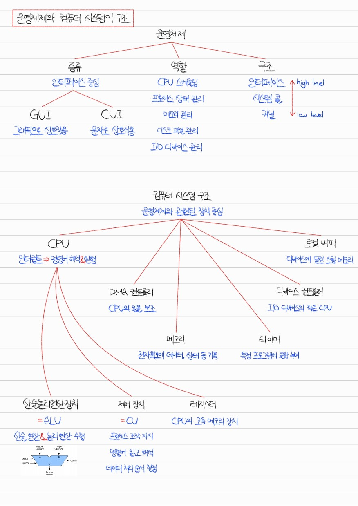
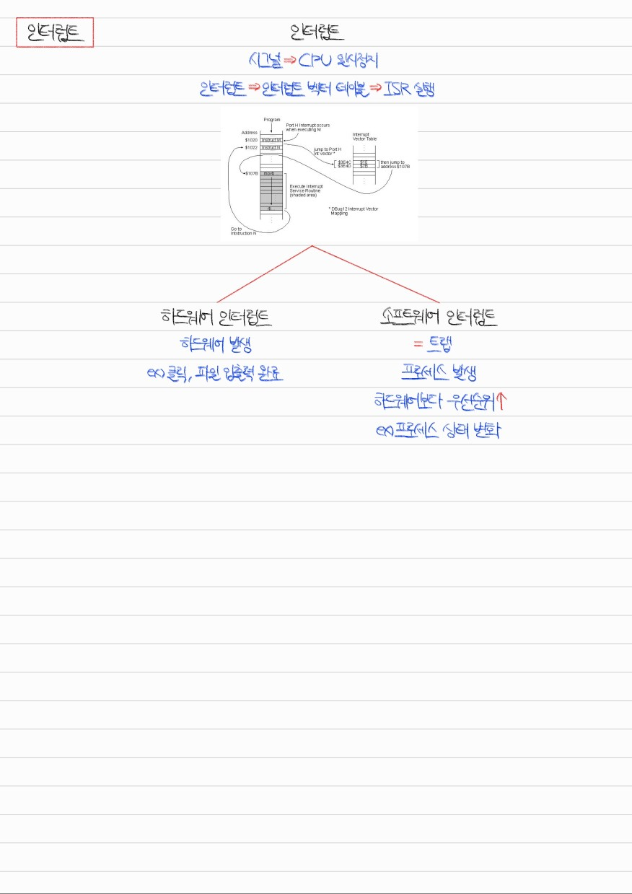
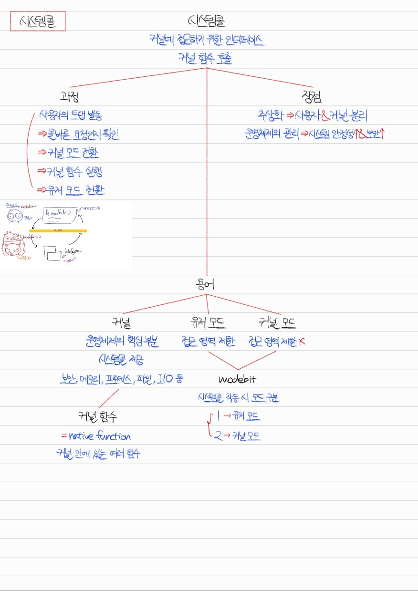
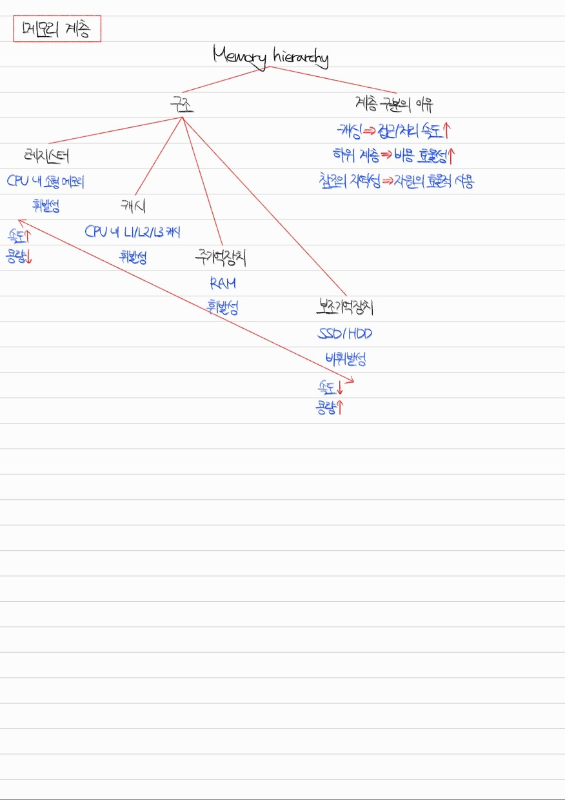

# Section 3. 운영체제

## 운영체제와 컴퓨터 시스템의 구조

Q1. 운영체제란 무엇이고, 컴퓨터에서 어떤 역할을 하나요?

운영체제는 하드웨어부터 사용자의 소프트웨어 사이를 계층적으로 분류하였을 때 있는 커널, 시스템 콜, 인터페이스를 합친 것입니다.

운영체제는 CPU 스케줄링, 프로세스 상태 관리, 메모리 관리, 파일 시스템 관리, I/O 디바이스 관리 등의 역할을 담당합니다.

## 인터럽트(interrupt)

Q2. 인터럽트란 무엇입니까?

인터럽트란 시그널을 발생시켜 CPU의 순차적인 작업을 일시적으로 중단하는 것입니다. 인터럽트가 발생하면 인터럽트 벡터 테이블에서 그에 맞는 인터럽트 서비스 루틴(ISR)을 찾아 실행시키고 실행 흐름이 인터럽트 발생 지점으로 돌아오게 됩니다.

인터럽트는 하드웨어 인터럽트와 소프트웨어 인터럽트로 나뉩니다. 하드웨어 인터럽트는 마우스 클릭, 파일 입출력 완료 등의 이벤트로 인해 발생합니다. 소프트웨어 인터럽트는 트랩이라고도 부르며, 프로세스 상태 변화 등의 이벤트로 인해 발생합니다. 처리되는 우선순위는 하드웨어 인터럽트보다 소프트웨어 인터럽트가 더 높습니다.

## 시스템 콜(system call)과 modebit

Q3. 시스템 콜이란 무엇입니까?

시스템 콜이란 커널 함수를 사용하기 위한 인터페이스입니다. 사용자가 시스템 콜 사용으로 트랩을 발생시키면 올바른 요청인지 확인한 이후 modebit가 0으로 바뀌어 커널 모드로 전환됩니다. 이후 커널 함수가 실행되고 그 결과가 반환되면서 modebit가 다시 1으로 바뀌어 유저 모드로 전환됩니다.

## 메모리 계층(memory hierarchy)

Q4. 메모리 계층에 대해 설명해 보세요.

메모리 계층은 메모리의 접근성, 용량에 따라 메모리를 계층적으로 구분한 것입니다. 중앙처리장치로부터 가까운 순서대로 레지스터, 캐시, 주기억장치, 보조기억장치로 구분됩니다.

레지스터는 CPU 내의 소형 메모리로 가장 빠르게 접근할 수 있으나 용량은 가장 적고 휘발성이라는 특징을 갖습니다.

캐시는 CPU 내의 L1, L2, L3 캐시로 레지스터에 비해 느리나 고속으로 접근할 수 있습니다. 용량은 레지스터 다음으로 적고 휘발성이라는 특징을 갖습니다.

주기억장치는 RAM이라고도 부르며, 접근 속도와 용량 모두 메모리 계층에서 중간 정도에 해당하며 휘발성이라는 특징을 갖습니다.

보조기억장치는 SSD/HDD라고도 부르며, 접근 속도는 가장 느리지만 용량은 가장 많습니다. 또한, 다른 메모리 장치들과 달리 비휘발성이라는 특징을 가져서 한 번 쓴 정보가 컴퓨터 종료 시에도 유실되지 않습니다.

