# Section 3. 운영체제

## 운영체제와 컴퓨터 시스템의 구조


<details>
<summary>Q1. 운영체제란 무엇이고, 컴퓨터에서 어떤 역할을 하나요?</summary>

운영체제는 하드웨어부터 사용자의 소프트웨어 사이를 계층적으로 분류하였을 때 있는 커널, 시스템 콜, 인터페이스를 합친 것입니다.

운영체제는 CPU 스케줄링, 프로세스 상태 관리, 메모리 관리, 파일 시스템 관리, I/O 디바이스 관리 등의 역할을 담당합니다.

</details>

## 인터럽트(interrupt)


<details>
<summary>Q2. 인터럽트란 무엇입니까?</summary>

인터럽트란 시그널을 발생시켜 CPU의 순차적인 작업을 일시적으로 중단하는 것입니다. 인터럽트가 발생하면 인터럽트 벡터 테이블에서 그에 맞는 인터럽트 서비스 루틴(ISR)을 찾아 실행시키고 실행 흐름이 인터럽트 발생 지점으로 돌아오게 됩니다.

인터럽트는 하드웨어 인터럽트와 소프트웨어 인터럽트로 나뉩니다. 하드웨어 인터럽트는 마우스 클릭, 파일 입출력 완료 등의 이벤트로 인해 발생합니다. 소프트웨어 인터럽트는 트랩이라고도 부르며, 프로세스 상태 변화 등의 이벤트로 인해 발생합니다. 처리되는 우선순위는 하드웨어 인터럽트보다 소프트웨어 인터럽트가 더 높습니다.

</details>

## 시스템 콜(system call)과 modebit


<details>
<summary>Q3. 시스템 콜이란 무엇입니까?</summary>

시스템 콜이란 커널 함수를 사용하기 위한 인터페이스입니다. 사용자가 시스템 콜 사용으로 트랩을 발생시키면 올바른 요청인지 확인한 이후 modebit가 0으로 바뀌어 커널 모드로 전환됩니다. 이후 커널 함수가 실행되고 그 결과가 반환되면서 modebit가 다시 1으로 바뀌어 유저 모드로 전환됩니다.

</details>

## 메모리 계층(memory hierarchy)


<details>
<summary>Q4. 메모리 계층에 대해 설명해 보세요.</summary>

메모리 계층은 메모리의 접근성, 용량에 따라 메모리를 계층적으로 구분한 것입니다. 중앙처리장치로부터 가까운 순서대로 레지스터, 캐시, 주기억장치, 보조기억장치로 구분됩니다.

레지스터는 CPU 내의 소형 메모리로 가장 빠르게 접근할 수 있으나 용량은 가장 적고 휘발성이라는 특징을 갖습니다.

캐시는 CPU 내의 L1, L2, L3 캐시로 레지스터에 비해 느리나 고속으로 접근할 수 있습니다. 용량은 레지스터 다음으로 적고 휘발성이라는 특징을 갖습니다.

주기억장치는 RAM이라고도 부르며, 접근 속도와 용량 모두 메모리 계층에서 중간 정도에 해당하며 휘발성이라는 특징을 갖습니다.

보조기억장치는 SSD/HDD라고도 부르며, 접근 속도는 가장 느리지만 용량은 가장 많습니다. 또한, 다른 메모리 장치들과 달리 비휘발성이라는 특징을 가져서 한 번 쓴 정보가 컴퓨터 종료 시에도 유실되지 않습니다.

</details>

## 가상 메모리

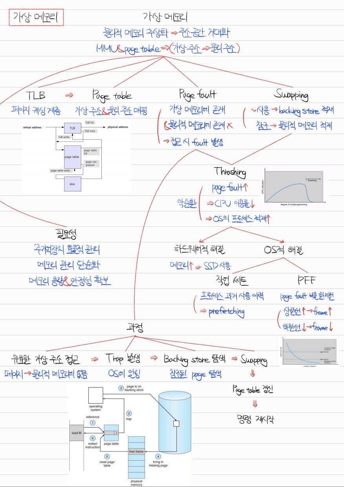

<details>
<summary>Q5. 가상 메모리란 무엇이고, 왜 사용하나요?</summary>

가상 메모리란 물리적 메모리를 추상화하여 실제 물리적 메모리 공간보다 많은 공간을 사용할 수 있게 만드는 메모리 관리 기술입니다. 이를 위해 주소 공간을 가상 주소 공간과 물리 주소 공간으로 분리하고, 가상 주소 공간은 페이지라는 단위로 관리하며 물리 주소 공간은 프레임이라는 단위로 관리합니다. 사용자가 사용하는 메모리 공간은 모두 가상 주소를 통해 접근되며, MMU와 페이지 테이블을 통해 가상 주소가 물리 주소로 매핑됩니다. 이때 물리 주소 공간에 참조한 페이지에 대응되는 프레임이 적재되어 있으면 페이지 히트가 발생하고, 그렇지 않으면 페이지 미스가 발생합니다.

TLB, page table에 대한 적법한 참조 후 페이지 미스 발생 시 페이지 폴트 트랩이 발생하여 OS가 보조기억장치의 Backing store를 탐색한 후 페이지에 대응되는 프레임을 물리 주소 공간에 적재하는 스와핑이 발생하고 페이지 테이블 갱신 후 중단 지점에서 프로그램이 다시 실행됩니다. 이렇게 사용되지 않는 페이지는 Backing store에 저장하고, 사용되는 페이지는 물리 주소 공간에 적재하는 스와핑이 물리 주소 공간의 실제 크기보다 더 많은 크기의 메모리를 사용할 수 있게 해주는 원천입니다.

이러한 점으로 가상 메모리 기술을 사용하면 메모리 공간을 효율적으로 사용할 수 있고 관리도 단순화됩니다. 또한 가상 주소 공간에서 일차적으로 메모리 참조가 적법한 참조인지를 판단하기 때문에 메모리 보안 측면에서도 이점이 있습니다.

</details>

<details>
<summary>Q6. 메인 메모리보다 많은 공간을 사용할 수 있다면, 메인 메모리는 매우 작은 것을 장착하고 프로그램을 무한정 실행시켜도 되지 않을까요?</summary>

그렇지 않습니다. 가상 메모리 기술을 사용하면 메인 메모리보다 큰 공간이 가용해지는 것은 사실이나, 동시간대에 많은 프로그램이 실행되면 그만큼 메모리 참조 시 페이지 폴트의 발생 비율도 올라갈 것입니다. 이로 인해 CPU의 사용률이 낮아질 것이고, 이를 Thrashing이라고 합니다.

Thrashing을 해결하고 CPU 사용률을 높일 수 있는 방법은 하드웨어적으론 메인 메모리 용량을 늘리거나 Backing store를 위한 보조기억장치로 HDD 대신 SSD를 사용하는 것이 있고, 운영체제적으론 과거 프로세스의 메모리 사용 패턴을 기반으로 prefetching하는 작업 세트 방식과 페이지 폴트 비율에 상한선과 하한선을 두고 상한선 이상일 때 할당된 프레임 개수를 늘리고, 하한선 이하일 때 할당된 프레임 개수를 줄이는 PFF 방식이 있습니다.


</details>

## 페이지 히트와 페이지 미스

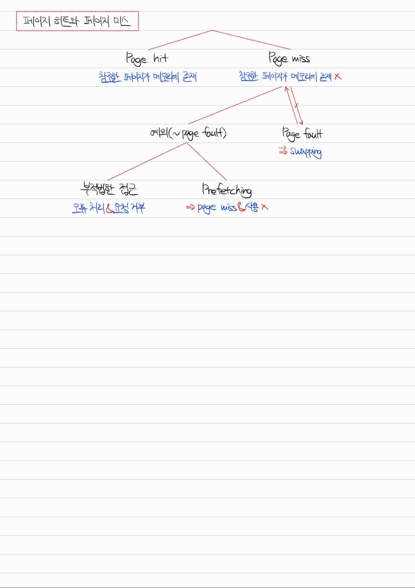

<details>
<summary>Q7. 페이지 히트, 페이지 미스, 페이지 폴트의 차이점은 무엇인가요?</summary>

페이지 히트는 참조한 페이지에 대응되는 프레임이 물리 주소 공간에 존재하는 것입니다. 페이지 미스는 반대로 참조한 페이지에 대응되는 프레임이 물리 주소 공간에 존재하지 않는 것입니다.

페이지 폴트는 페이지 미스의 한 종류로, 적법한 페이지 참조에 대해 대응되는 프레임이 물리 주소 공간에 존재하지 않아 스와핑을 수행하는 것입니다. 즉, 페이지 폴트는 페이지 미스이지만 페이지 미스는 페이지 폴트가 아닐 수 있습니다. 예를 들어 적법하지 않은 참조나, 단순 prefetching만 발생하고 페이지의 사용은 발생하지 않았을 시엔 페이지 미스라고는 할 수 있으나 페이지 폴트라고는 할 수 없습니다.

</details>

## 페이지 교체 알고리즘

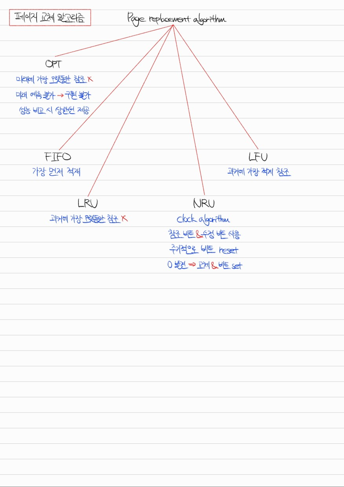

<details>
<summary>Q8. 스와핑은 어떤 기준으로 수행하나요?</summary>

물리 주소 공간이 여유롭지 않아 스와핑이 발생할 시 페이지 교체 알고리즘에 의해 교체될 프레임이 결정됩니다. 페이지 교체 알고리즘으로는 OPT, FIFO, LRU, LFU, NRU 등이 있습니다.

OPT 알고리즘은 미래에 가장 오랫동안 사용되지 않을 페이지를 교체하는 것입니다. 이 문제는 그리디 알고리즘의 한 종류이기 때문에 OPT 알고리즘이 전역 최적해이지만, 미래는 예측할 수 없기 때문에 구현은 불가능합니다. 때문에 실제로 사용되지는 않고 다른 알고리즘과의 성능 비교 시 상한선을 제공합니다.

FIFO는 적재된 순서대로 페이지를 교체하는 것입니다.

LRU는 과거에 가장 오랫동안 사용되지 않은 페이지를 교체하는 것입니다.

LFU는 과거에 가장 자주 사용되지 않은 페이지를 교체하는 것입니다.

NRU는 clock 알고리즘이라고도 부르며, 참조 비트와 수정 비트를 두고 주기적으로 비트를 reset합니다. 탐색하면서 비트가 0인 것을 교체하고 1로 바꾸는 방식으로 가장 오랫동안 사용되지 않은 페이지가 아닌 비교적 최근에 사용되지 않은 페이지를 교체합니다.

</details>

## 프로세스와 스레드의 차이

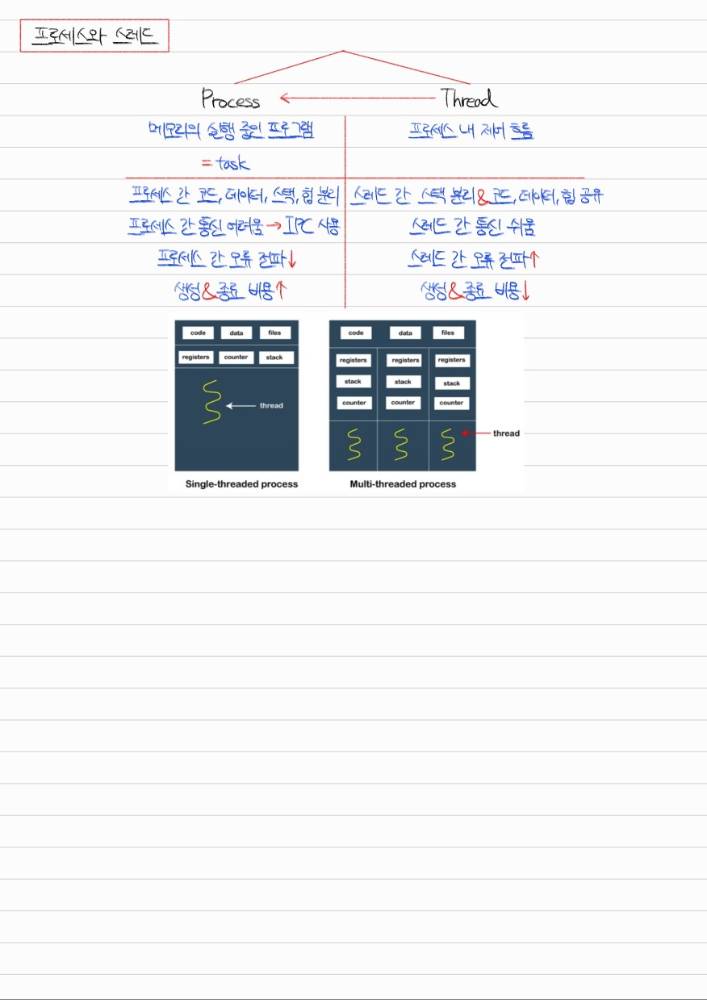

<details>
<summary>Q9. 프로세스와 스레드의 차이점이 무엇인가요?</summary>

프로세스는 메인 메모리에 프로그램이 적재되어 실행 중인 것을 의미하고, 스레드는 프로세스 내의 논리적인 제어 흐름을 의미합니다.

주소 공간의 관점에서, 프로세스 간에는 독립적인 주소 공간을 갖지만 스레드 간에는 스택만 독립적이고 코드, 데이터, 힙 공간은 공유합니다. 때문에 프로세스 간에는 통신이 어려워 Inter-Process Communiation(IPC)라는 기술을 사용하고, 스레드 간에는 쉽게 직접 통신이 가능합니다.

또한, 어떤 프로세스에서 문제가 발생했을 때 보통 그 문제는 다른 프로세스로 쉽게 전이되지 않습니다. 그러나 어떤 스레드에서 문제가 발생했을 때 그 문제는 다른 스레드로 쉽게 전이됩니다.

마지막으로, 프로세스의 생성, 삭제, 컨텍스트 스위칭 비용은 프로세스가 더 높고, 스레드가 더 낮습니다.

</details>

## 프로그램의 컴파일 과정

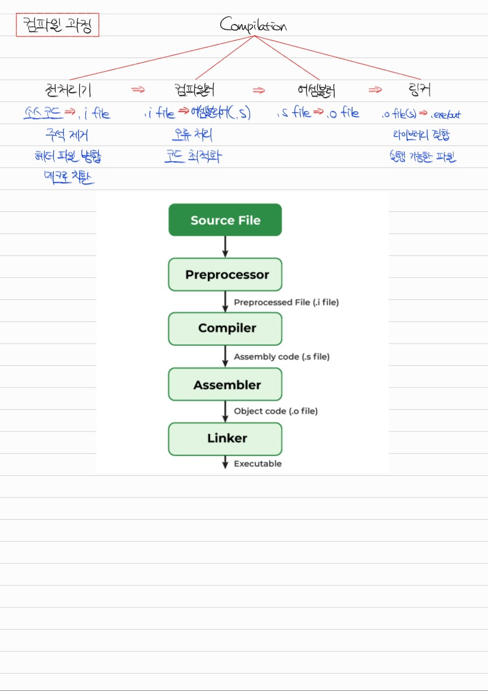

<details>
<summary>Q10. 소스 코드가 컴파일되는 과정을 설명하세요.</summary>

컴파일 과정은 크게 전처리, 컴파일, 어셈블, 링킹으로 구분됩니다.

전처리 과정에선 소스 코드의 주석이 제거되고, 헤더 파일이 포함되며, 매크로가 치환되는 등의 일이 일어납니다. 그 결과로 전처리기는 소스 코드를 .i 확장자의 파일로 변환합니다.

컴파일 과정에선 전처리된 파일이 어셈블리어로 변환되며 이 과정에서 오류가 검사되고, 코드 최적화가 발생합니다. 그 결과로 .i 확장자 파일은 .s 확장자의 어셈블리어 파일로 변환됩니다.

어셈블 과정에선 .s 확장자의 어셈블리어 파일이 .o 확장자의 목적 파일로 변환됩니다.

링킹 과정에선 라이브러리 함수들이 연결되어 실행 가능한 파일이 생성됩니다. 그 결과로 .o 확장자 파일들이 .exe 또는 .out 확장자의 실행 가능한 파일로 변환됩니다.

</details>

## 프로세스의 주소 공간 구조

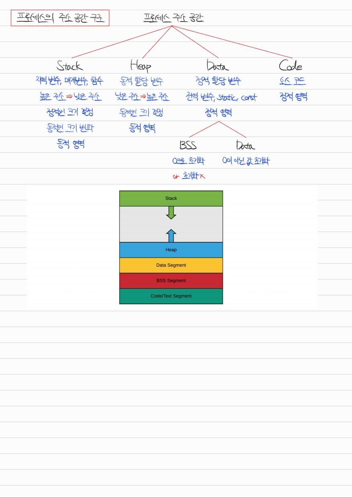

<details>
<summary>Q11. 프로세스의 주소 공간은 어떻게 구성되고, 각 공간에는 어떤 데이터들이 저장되나요?</summary>

프로세스의 주소 공간은 높은 주소에서 낮은 주소로 증가하는 동적 공간인 스택, 낮은 주소에서 높은 주소로 증가하는 동적 공간인 힙, 정적 공간인 데이터와 코드 영역들로 구성됩니다.

스택 영역에는 지역 변수, 매개 변수, 함수 등이 저장됩니다. 정적으로 크기가 결정되나, 재귀 호출과 같은 요인으로 동적으로 크기가 변환될 수 있습니다.

힙 영역에는 동적 할당된 변수들이 저장됩니다. 때문에 동적으로 크기가 결정됩니다.

데이터 영역에는 전역 변수, static 변수, const 변수와 같은 정적 변수들이 저장됩니다. 데이터 영역은 또 다시 BSS 영역과 Data 영역으로 구분되는데, BSS 영역에는 0으로 초기화되거나 초기화되지 않은 변수들이 저장되고, Data 영역에는 0이 아닌 값으로 초기화된 변수들이 저장됩니다.

코드 영역에는 소스 코드가 저장됩니다.

</details>

## PCB와 컨텍스트 스위칭

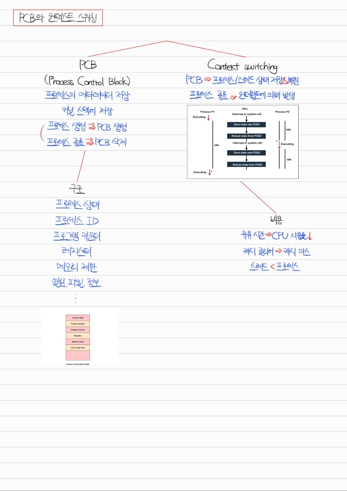

<details>
<summary>Q12. PCB에 대해 설명해 보세요.</summary>

PCB, Process Control Block은 프로세스의 메타데이터가 저장된 커널 스택의 블록입니다. 프로세스 생성 시 생성되고, 종료 시 삭제됩니다. 그 내용으로는 프로세스의 상태, 프로세스의 ID, 프로그램 카운터, 레지스터 정보, 메모리 제한 정보, 열린 파일들의 정보 등 프로세스 실행에 필요한 정보들이 담깁니다.

</details>

<details>
<summary>Q13. 컨텍스트 스위칭이란 무엇인가요?</summary>

컨텍스트 스위칭은 메모리 공간에 프로세스를 적재하고, 기존에 있던 프로세스를 삭제하는 과정에서 PCB를 기반으로 프로세스의 상태를 저장하고 불러오는 과정입니다.

</details>

## 프로세스의 상태

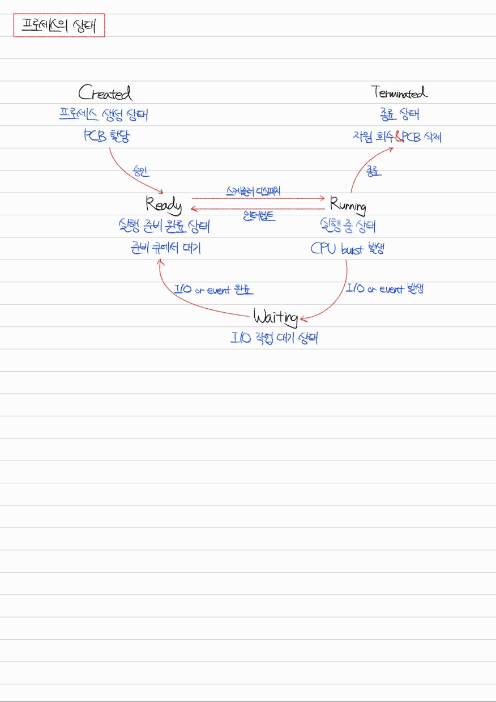

<details>
<summary>Q14. 프로세스가 가질 수 있는 상태들에 대해 설명해 보세요.</summary>

프로세스의 상태는 Created, Ready, Running, Waiting, Terminated가 있습니다.

Created는 프로세스가 생성된 상태로, 이 상태일 때 PCB가 할당됩니다. 승인되면 Ready 상태로 전환됩니다.

Ready는 프로세스의 실행이 준비 완료된 상태로, 준비 큐에서 대기하고 있는 상태입니다. CPU 스케줄러의 디스패치를 통해 Running 상태로 전환됩니다.

Running은 프로세스가 CPU와 메모리 공간에 대한 제어권을 가지고 실행되고 있는 상태입니다. 이 상태에서 종료되면 Terminated 상태로, I/O 또는 이벤트가 발생하면 Waiting 상태로 전환됩니다.

Waiting은 I/O 또는 이벤트가 끝나기를 대기하는 상태입니다. 해당 I/O 또는 이벤트가 끝나면 다시 Ready 상태로 전환됩니다.

Terminated는 프로세스가 종료된 상태입니다. 이때 PCB의 삭제 및 자원 회수가 일어납니다.

</details>

## 멀티프로세싱과 멀티스레딩

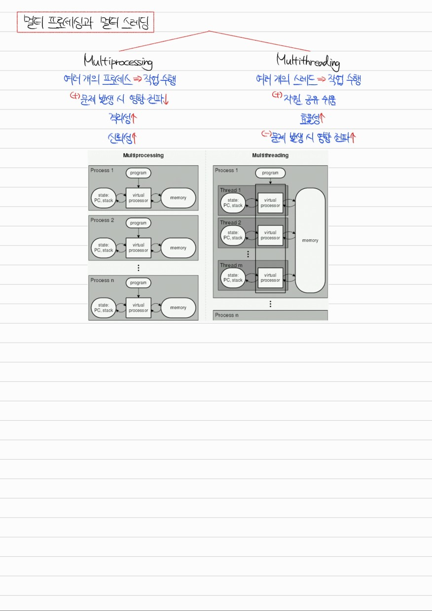

<details>
<summary>Q15. 멀티프로세싱과 멀티스레딩의 차이점은 무엇인가요?</summary>

멀티프로세싱은 작업을 여러 개의 프로세스를 사용하여 수행하는 것이고, 멀티스레딩은 여러 개의 스레드를 사용하여 수행하는 것입니다.

멀티프로세싱 사용 시엔 프로세스 간 독립적인 주소 공간을 갖기 때문에 격리성과 신뢰성이 올라가고 문제 발생 시 그 영향이 쉽게 전파되지 않는다는 장점이 있습니다.

멀티스레딩 사용 시엔 스레드 간 스택을 제외한 메모리 공간을 공유하기 때문에 자원 공유가 쉽고 효율성이 높다는 장점이 있으나, 문제 발생 시 그 영향이 전파되기 쉽다는 단점도 있습니다.

</details>

## IPC(Inter Process Communication)

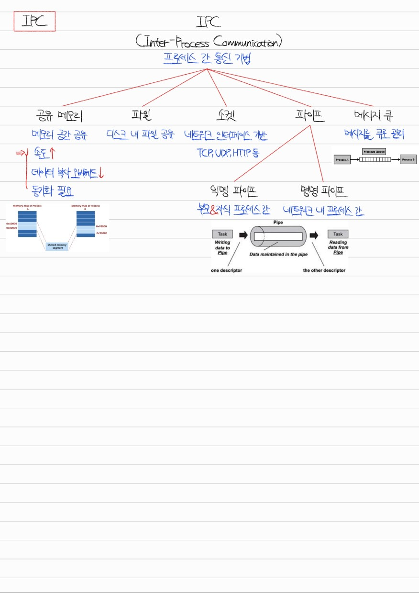

<details>
<summary>Q16. IPC에 대해 설명해 보세요.</summary>

IPC, Inter-Process Communiation은 프로세스들 간에 통신하기 위한 기법입니다. 공유 메모리, 파일, 소켓, 파이프, 메시지 큐 방식이 사용됩니다.

공유 메모리 방식은 메모리의 특정 공간을 공유하는 방식으로, 소곧가 빠르고, 데이터 복사 오버헤드가 낮고, 동기화가 필요하다는 특징이 있습니다.

파일 방식은 디스크에 저장된 파일을 공유하는 방식입니다.

소켓 방식은 네트워크 인터페이스를 통한 방식입니다. TCP, UDP, HTTP 등이 이에 해당합니다.

파이프 방식은 FIFO 큐 기반으로 메시지를 순차적으로 전달하는 방식으로, 익명 파이프와 명명 파이프로 나뉩니다. 익명 파이프는 부모-자식 프로세스 간에만 통신이 가능하고, 명명 파이프는 부모-자식 프로세스 외에도 네트워크 내에 있는 프로세스 간 통신이 가능합니다.

메시지 큐 방식은 메시지를 큐로 관리하며, 전송된 메시지가 큐에 복사되고 송신자가 이를 하나씩 읽어가며 통신하는 방식입니다.

</details>

## 공유 자원, 경쟁 상태, 임계 영역

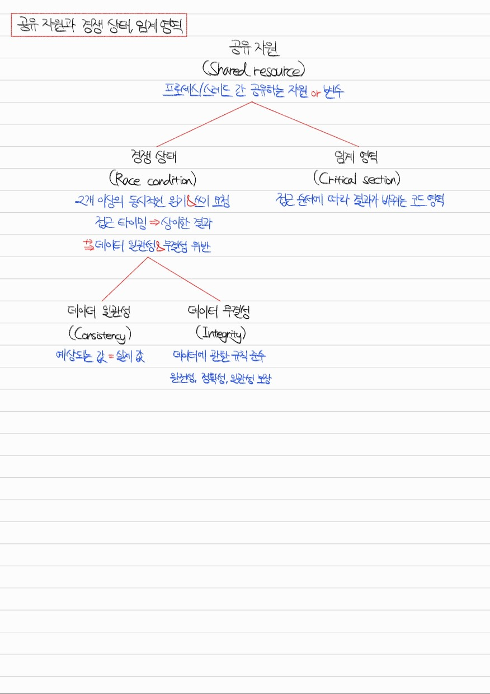

<details>
<summary>Q17. 경쟁 상태란 무엇인가요?</summary>

경쟁 상태(Race condition)는 공유 자원을 두고 두 개 이상의 스레드가 동시에 읽기, 쓰기 연산을 시도하는 상태입니다. 이때 여러 개의 스레드가 연산을 수행하는 인스트럭션 순서에 따라 그 결과가 바뀔 수 있습니다. 때문에 경쟁 상태를 적절히 처리하지 않으면 데이터 일관성과 무결성이 무너지게 됩니다.

</details>

<details>
<summary>Q18. 임계 영역이란 무엇인가요?</summary>

임계 영역(Critical section)이란 경쟁 상태가 발생하는 코드 영역을 의미합니다. 임계 영역을 lock과 같은 장치로 보호하지 않으면 경쟁 상태로 인한 데이터 일관성과 무결성 파괴 문제가 발생하게 됩니다.

</details>

## 동기화 도구(뮤텍스, 세마포어, 모니터)

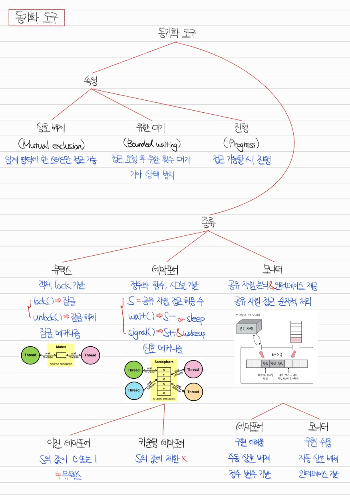

<details>
<summary>Q19. 동기화를 위한 소프트웨어적 도구에 대해 설명해 보세요.</summary>

동기화를 위해 소프트웨어적으로는 뮤텍스, 세마포어, 모니터를 사용할 수 있습니다. 이들 모두 상호 배제, 유한 대기, 진행의 속성을 만족한다는 속성을 가집니다.

상호 배제는 공유 자원에 한 번에 하나의 스레드만 접근할 수 있는 것이고, 유한 대기는 공유 자원에 대한 접근을 요청한 이후 다른 스레드의 접근이 유한 번으로 보장되어 어떤 스레드도 무한정 대기할 수 없는 것이고, 진행은 공유 자원이 접근 가능한 상태일 때 스레드 간 방해하지 않고 순서대로 진행할 수 있는 것입니다.

뮤텍스는 잠금 메커니즘을 사용하는 동기화 도구로, 객체 lock에 대한 소유권으로 공유 자원에 대한 접근 권한을 조정합니다. 객체 lock을 lock 메서드로 잠금, unlock 메서드로 잠금 해제합니다.

세마포어는 신호 메커니즘을 사용하는 동기화 도구로, 정수 값을 가지는 변수 S와 그에 대한 wait(), signal()연산으로 공유 자원에 대한 접근 권한을 조정합니다. wait()은 S의 값을 1 낮추거나, S의 값이 0일 경우엔 진행하지 않고 프로세스가 잠들게 합니다. signal()은 S의 값을 1 늘리고, wait() 수행을 시도하다 잠든 프로세스가 있다면 이를 깨웁니다. 세마포어는 S의 값이 0 또는 1만 가지는 이진 세마포어와 어떤 값이든 가질 수 있는 카운팅 세마포어로 구분됩니다.

모니터는 공유 자원을 은닉하고 이에 대한 인터페이스를 제공하여 공유 자원에 대한 접근 권한을 조정합니다. 공유 자원에 대한 접근 시도는 대기열로 관리되어 순차적으로 처리되기 때문에 경쟁 상태에 대해 걱정할 필요가 없습니다.

</details>

## 교착 상태(Deadlock)

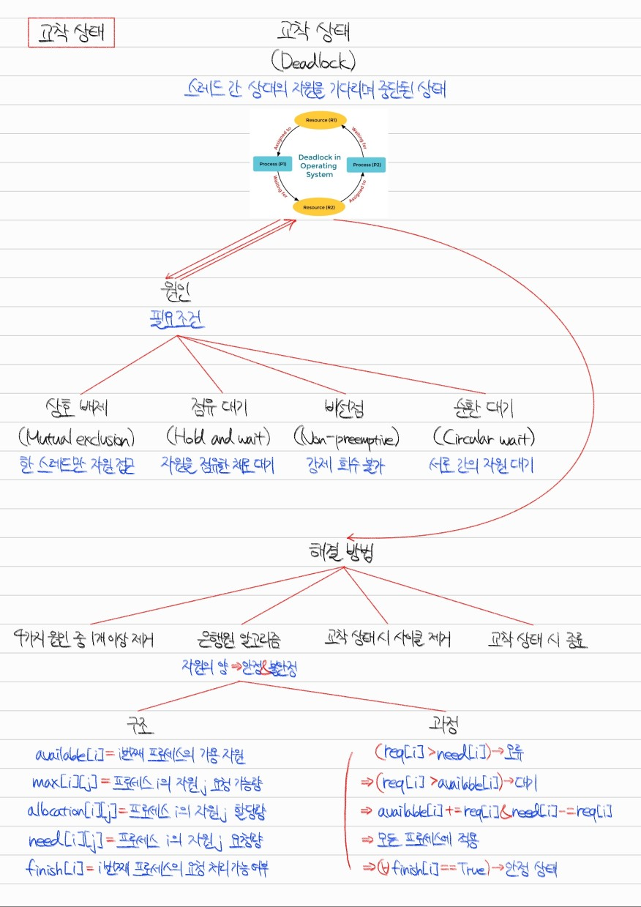

<details>
<summary>Q20. 교착 상태는 왜 발생하고, 어떻게 해결할 수 있나요?</summary>

교착 상태는 상호 배제, 점유 대기, 비선점, 순환 대기의 4가지 조건을 만족하면 발생할 수 있습니다. 상호 배제는 공유 자원에 한 번에 하나의 스레드만 접근 가능한 것, 점유 대기는 공유 자원을 점유한 채로 대기하는 것, 비선점은 다른 스레드의 공유 자원을 강제로 회수할 수 없는 것, 순환 대기는 스레드 간 상대방의 자원에 대해 대기하고 있는 것입니다.

교착 상태를 해결하기 위해선 위 4가지 조건 중 하나를 제거하거나, 은행원 알고리즘을 사용해 안정 상태일 때만 요청한 자원을 할당하거나, 교착 상태 발생 시 사이클을 판단하고 관련된 프로세스들을 종료하거나, 교착 상태 발생 시 사용자가 직접 시스템을 종료하는 방법이 사용될 수 있습니다.

</details>

## CPU 스케줄링 알고리즘

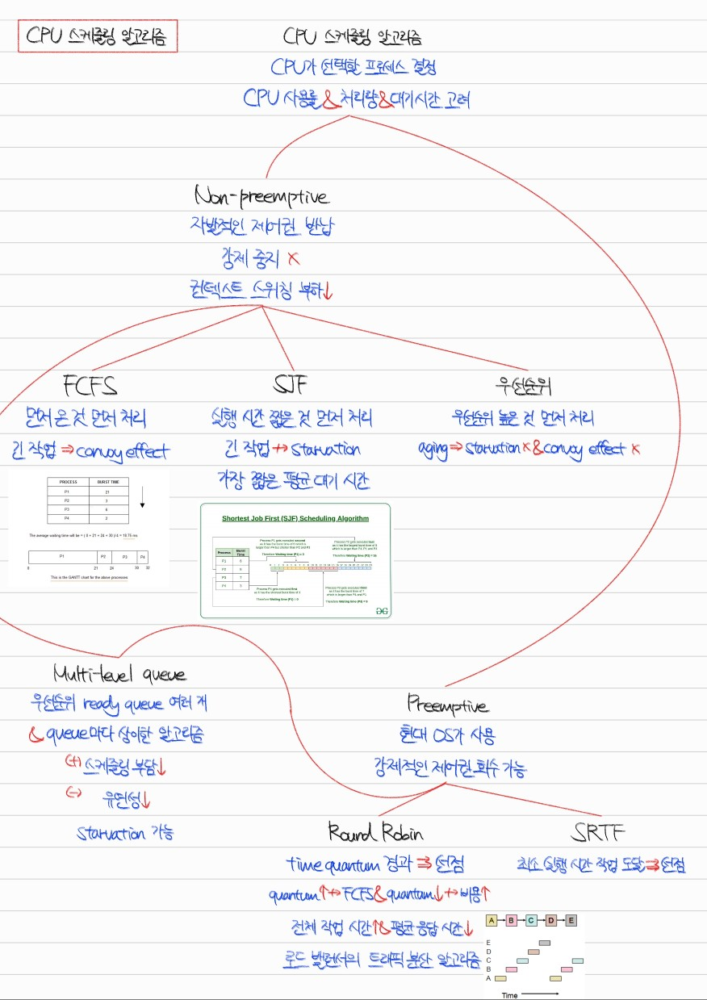

<details>
<summary>Q21. CPU 스케줄링 알고리즘에 대해 설명해 보세요.</summary>

CPU 스케줄링 알고리즘은 CPU 스케줄러가 디스패치할 다음 프로세스를 결정하기 위한 알고리즘입니다. 종류는 비선점형, 선점형으로 나뉘고 현대 OS는 선점형 알고리즘을 사용합니다.

비선점형 스케줄링 알고리즘에는 도달한 순서대로 처리하는 FCFS, 남은 실행 시간이 짧은 순서대로 처리하는 SJF, 높은 우선순위인 것을 먼저 처리하는 우선순위 알고리즘이 있습니다. SJF는 긴 작업이 starvation을 겪을 수 있지만 우선순위 알고리즘은 aging 기법을 도입하여 starvation을 방지합니다.

선점형 스케줄링 알고리즘에는 지정된 time quantum만큼 수행하고 선점되는 Round Robin, 남은 실행 시간이 가장 짧은 순서대로 처리하고 새로이 도달한 작업의 남은 실행 시간이 더 짧을 경우 선점하는 SRTF 알고리즘이 있습니다.

두 알고리즘을 합친 Multi-level queue 알고리즘도 존재하는데, 이것은 ready queue를 여러 개로 분할하고 각각의 ready queue마다 상이한 스케줄링 알고리즘을 적용한 것입니다.

</details>

## 캐시

**Example) Node.js node-cache**
```
const express = require("express");
const NodeCache = require("node-cache");

const app = express();
const cache = new NodeCache();
const obj = {
    "userId": 1,
    "id": 1,
    "title": "hello world!",
    "completion": false,
};

app.get("/data", (req, res) => {
    const value = cache.get("data");

    if (value) {
        console.log("Request has been cached. Respond the cached data.");
        return res.json(value);
    } else {
        console.log("Request has not been cached. Update the cache and respond.");
        setTimeout(() => {
            cache.set("data", obj);
            return res.json(obj);
        }, 2000);
    }
});

app.listen(3000, () => {
    console.log("Cache server is running on http://locahost:3000");
})
```

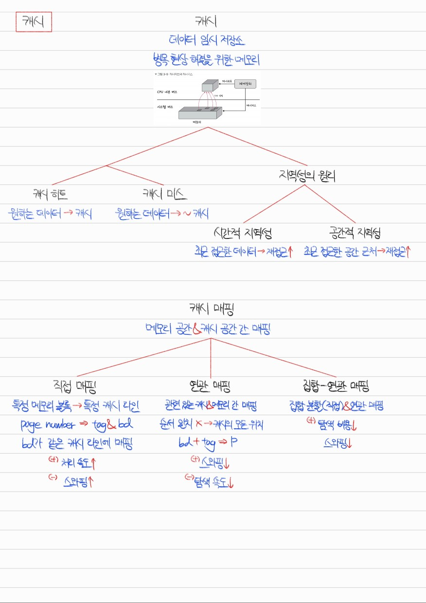

<details>
<summary>Q22. 캐시의 참조의 지역성에 대해 설명하고 이것이 왜 중요한지 설명해 보세요.</summary>

참조의 지역성이란 시간적, 공간적으로 근접한 것이 다시 참조될 가능성이 높은 특성입니다. 시간적 지역성은 최근 참조된 데이터가 다시 참조될 가능성이 높다는 것이고, 공간적 지역성은 최근 참조된 위치 근처가 다시 참조될 가능성이 높다는 것입니다.

참조의 지역성이 중요한 이유는 캐시로 사용되는 메모리가 그 하위 계층의 메모리에 비해 비싸고 용량이 적기 때문에 저장될 데이터를 효율적이게 선택하기 위함입니다.

</details>

<details>
<summary>Q23. 캐시 매핑의 방식들에 대해 설명해 보세요.</summary>

캐시 매핑에는 직접 매핑, 연관 매핑, 집합-연관 매핑 세 가지 방식이 있습니다.

직접 매핑은 특정 메모리 공간을 순차적으로 특정 캐시 공간에 대응하는 것입니다. 페이지 번호를 tag, bd로 구분하고 같은 bd를 가지는 공간에 캐싱합니다. 이 방식은 빠른 처리 속도가 장점이지만 스와핑이 많이 발생할 수 있는 것이 단점입니다.

연관 매핑은 순서와 상관 없이 캐시의 모든 공간에 메모리의 데이터를 캐싱할 수 있는 것입니다. tag, bd를 합쳐 P를 만들고 이를 기준으로 데이터를 저장합니다. 이 방식은 스와핑이 적게 발생한다는 것이 장점이지만 접근 속도가 느리다는 것이 단점입니다.

집합-연관 매핑은 직접 매핑과 연관 매핑을 합한 것으로, bd에 따라 여러 개의 집합으로 캐시 공간을 나누고 이 공간에는 데이터를 연관 매핑 법칙에 따라 저장하는 것입니다. 이렇게 함으로써 직접 매핑의 장점인 처리 속도, 연관 매핑의 장점인 스와핑 횟수 절약을 둘 다 달성할 수 있습니다.

</details>