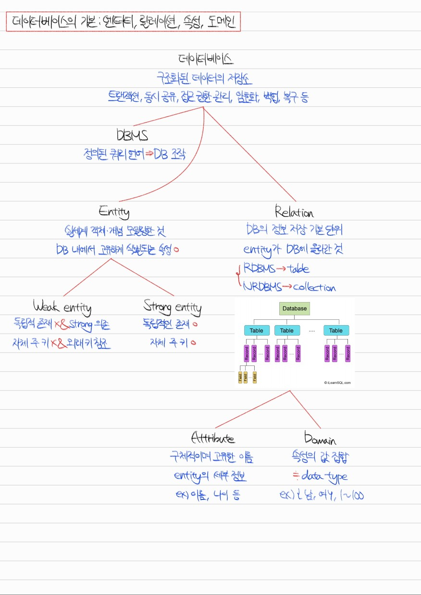
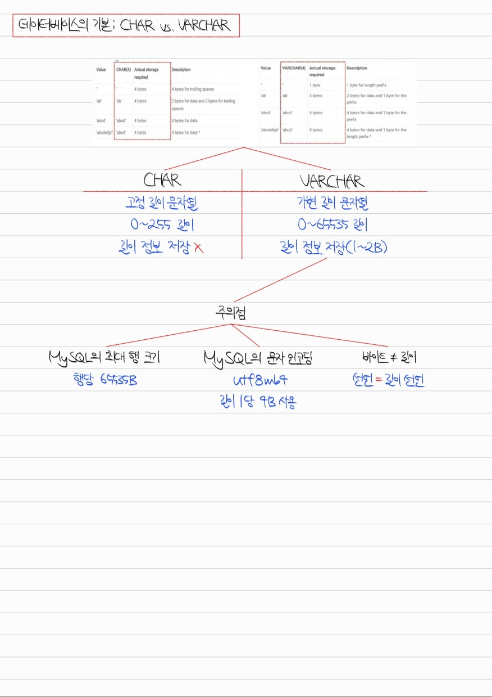
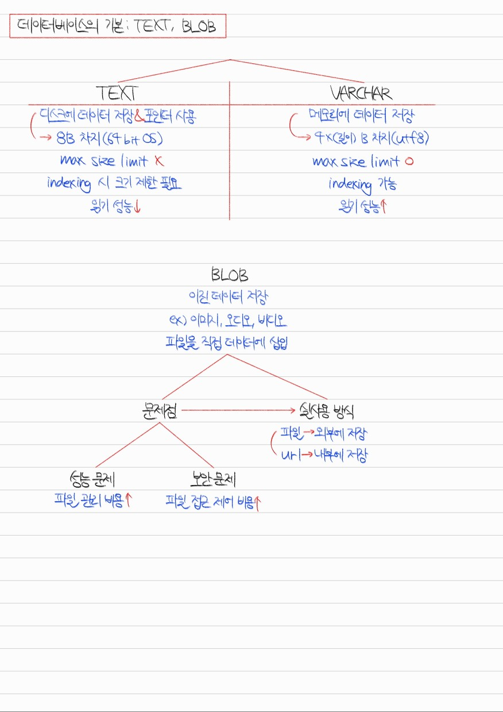
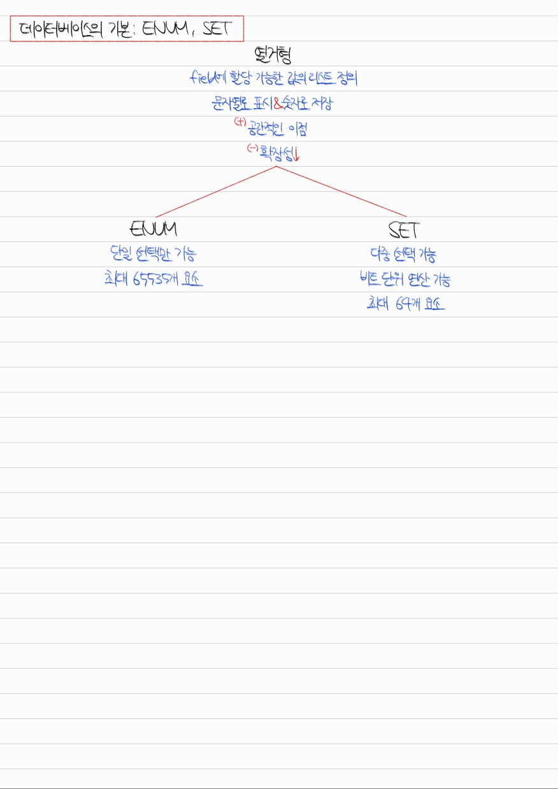

# Section 4. 데이터베이스

## 데이터베이스의 기본 #1. Entity, Relation, Attribute, Domain

Q1. Weak entity와 Strong entity의 차이점이 무엇인가요?

weak entity는 독립적으로 존재할 수 없고, strong entity에 의존적인 entity입니다. 때문에 보통 자기 자신의 primary key를 가지지 않고 관계된 strong entity의 primary key를 참조합니다. 반면, strong entity는 독립적으로 존재할 수 있고, 자기 자신의 primary key를 갖는 entity입니다.

strong entity의 예를 학생, 교과목으로 든다면, 이와 관련된 weak entity의 예는 수강신청과 같은 것이 있습니다. 학생이 없다면 수강신청도 불가능할 것입니다.

Q2. Relation이란 무엇인가요?

relation은 데이터베이스에 정보를 저장하기 위한 기본 단위로, 데이터베이스에 올라온 entity를 의미합니다. RDBMS에서는 table이라고 부르고 record들이 저장됩니다. NoSQL(MongoDB)에서는 collection이라고 부르고 document들이 저장됩니다.

Q3. Relation의 attribute, domain은 무엇인가요?

attribute는 relation을 구분할 수 있는, 고유한 이름을 가진 구체적 정보를 의미합니다. 예를 들어 학생 relation의 attribute는 이름, 나이, 성별 등이 있을 수 있습니다. domain은 이러한 attribute들이 가질 수 있는 값의 집합을 의미합니다. 예를 들어 성별은 {male, female}이라는 값 집합 안에서 그 값이 결정됩니다.

## 데이터베이스의 기본 #2-1. 필드, 레코드, 타입

Q4. 데이터베이스의 필드와 레코드의 차이점이 무엇인가요?

흔히 필드는 Column이라고 부르고, 레코드는 Row라고 부릅니다. 데이터는 Row 단위로 저장되고, 각 Row의 속성들을 필드라고 칭하는 것입니다. 그러므로 레코드는 필드의 집합이고, 필드는 고유한 타입을 갖는 속성 값이라고 할 수 있습니다.

## 데이터베이스의 기본 #2-2. CHAR와 VARCHAR의 차이

Q5. 데이터베이스의 CHAR, VARCHAR 타입의 차이점에 대해 설명해 보세요.

CHAR은 고정 길이 문자열을 저장하는 데이터 타입으로 길이는 최대 255까지 저장할 수 있습니다. VARCHAR은 가변 길이 문자열을 저장하는 데이터 타입으로 길이는 최대 65535까지 저장할 수 있습니다. 그러나 MySQL을 기준으로 문자열 인코딩은 utf8mb4를 기본으로 사용하는데, 이것은 길이 1에 4바이트를 할당하기 때문에 실제 저장 가능한 길이는 한정적입니다. 또한, VARCHAR은 길이 정보를 데이터 뒤에 1~2 바이트를 사용해 저장하기 때문에 실제 저장 가능한 길이는 한정적입니다.

## 데이터베이스의 기본 #2-3. TEXT와 BLOB

Q6. 데이터베이스의 TEXT, VARCHAR 타입의 차이점에 대해 설명해 보세요.

TEXT 타입은 데이터 자체는 디스크에 저장하고, 데이터에 대한 포인터를 메모리에 저장합니다. 반면 VARCHAR 타입은 데이터 자체를 메모리에 저장한다는 점에서 다릅니다.

또한, TEXT 타입은 max size limit을 걸 수 없어 고정적으로 최대 65535 길이의 데이터를 저장할 수 있고, VARCHAR 타입은 max size limit을 걸 수 있어 데이터의 최대로 저장 가능한 길이를 제한할 수 있습니다.

마지막으로, TEXT 타입은 인덱스 지정 시 최대 길이를 지정하여 앞에서부터 얼마 만큼의 길이를 인덱스로 사용할지 결정해야 합니다. 그러나 VARCHAR 타입은 이런 과정 없이 인덱스 지정이 가능합니다.

Q7. 데이터베이스에서 이미지 데이터를 관리하는 방법에 대해 설명해 보세요.

데이터베이스에서는 BLOB라는 데이터 타입을 제공하여 이진 데이터를 저장할 수 있게 하였으나, 메모리에 직접 이미지, 오디오, 비디오 등의 이진 데이터를 저장하면 성능상으로나 보안상으로 문제가 생길 수 있습니다.

따라서 실제로는 AWS S3 같은 클라우드 서비스를 사용하여 데이터를 외부에 저장하고, URL을 데이터베이스에 VARCHAR 타입으로 저장함으로써 이미지 데이터를 관리합니다.

## 데이터베이스의 기본 #2-4. ENUM과 SET

Q8. 데이터베이스의 열거형 타입에 대해 설명해 보세요.

데이터베이스의 열거형 타입은 Field의 지정 가능한 값의 리스트를 미리 정의하여 공간상의 이점을 취할 수 있는 데이터 타입입니다. 사용자에게는 문자열로 표시되지만 내부적으로는 숫자로 저장됩니다. 미리 값의 리스트를 정의한다는 점 때문에 확장성은 떨어진다는 단점이 있습니다.

열거형 타입에는 대표적으로 ENUM, SET이 존재합니다. ENUM 타입은 단일 선택만 가능하고, 최대 65535개의 요소를 저장할 수 있습니다. SET 타입은 다중 선택이 가능하고 비트 단위 연산도 수행할 수 있으며, 최대 64개의 요소를 저장할 수 있습니다.

