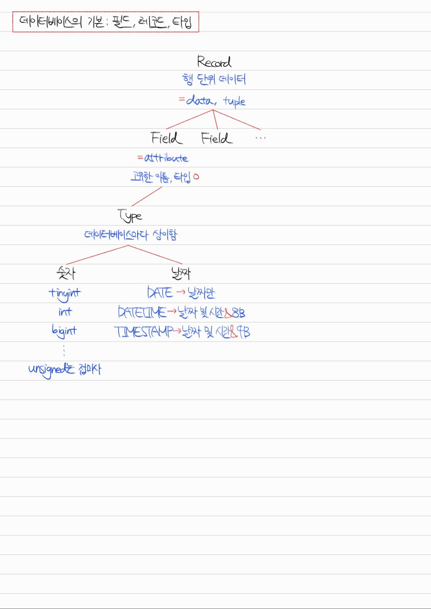

# Section 4. 데이터베이스

## 데이터베이스의 기본 #1. Entity, Relation, Attribute, Domain


<details>
<summary>Q1. Weak entity와 Strong entity의 차이점이 무엇인가요?</summary>

weak entity는 독립적으로 존재할 수 없고, strong entity에 의존적인 entity입니다. 때문에 보통 자기 자신의 primary key를 가지지 않고 관계된 strong entity의 primary key를 참조합니다. 반면, strong entity는 독립적으로 존재할 수 있고, 자기 자신의 primary key를 갖는 entity입니다.

strong entity의 예를 학생, 교과목으로 든다면, 이와 관련된 weak entity의 예는 수강신청과 같은 것이 있습니다. 학생이 없다면 수강신청도 불가능할 것입니다.

</details>

<details>
<summary>Q2. Relation이란 무엇인가요?</summary>

relation은 데이터베이스에 정보를 저장하기 위한 기본 단위로, 데이터베이스에 올라온 entity를 의미합니다. RDBMS에서는 table이라고 부르고 record들이 저장됩니다. NoSQL(MongoDB)에서는 collection이라고 부르고 document들이 저장됩니다.

</details>

<details>
<summary>Q3. Relation의 attribute, domain은 무엇인가요?</summary>

attribute는 relation을 구분할 수 있는, 고유한 이름을 가진 구체적 정보를 의미합니다. 예를 들어 학생 relation의 attribute는 이름, 나이, 성별 등이 있을 수 있습니다. domain은 이러한 attribute들이 가질 수 있는 값의 집합을 의미합니다. 예를 들어 성별은 {male, female}이라는 값 집합 안에서 그 값이 결정됩니다.

</details>

## 데이터베이스의 기본 #2-1. 필드, 레코드, 타입



<details>
<summary>Q4. 데이터베이스의 필드와 레코드의 차이점이 무엇인가요?</summary>

흔히 필드는 Column이라고 부르고, 레코드는 Row라고 부릅니다. 데이터는 Row 단위로 저장되고, 각 Row의 속성들을 필드라고 칭하는 것입니다. 그러므로 레코드는 필드의 집합이고, 필드는 고유한 타입을 갖는 속성 값이라고 할 수 있습니다.

</details>

## 데이터베이스의 기본 #2-2. CHAR와 VARCHAR의 차이


<details>
<summary>Q5. 데이터베이스의 CHAR, VARCHAR 타입의 차이점에 대해 설명해 보세요.</summary>

CHAR은 고정 길이 문자열을 저장하는 데이터 타입으로 길이는 최대 255까지 저장할 수 있습니다. VARCHAR은 가변 길이 문자열을 저장하는 데이터 타입으로 길이는 최대 65535까지 저장할 수 있습니다. 그러나 MySQL을 기준으로 문자열 인코딩은 utf8mb4를 기본으로 사용하는데, 이것은 길이 1에 4바이트를 할당하기 때문에 실제 저장 가능한 길이는 한정적입니다. 또한, VARCHAR은 길이 정보를 데이터 뒤에 1~2 바이트를 사용해 저장하기 때문에 실제 저장 가능한 길이는 한정적입니다.

</details>

## 데이터베이스의 기본 #2-3. TEXT와 BLOB


<details>
<summary>Q6. 데이터베이스의 TEXT, VARCHAR 타입의 차이점에 대해 설명해 보세요.</summary>

TEXT 타입은 데이터 자체는 디스크에 저장하고, 데이터에 대한 포인터를 메모리에 저장합니다. 반면 VARCHAR 타입은 데이터 자체를 메모리에 저장한다는 점에서 다릅니다.

또한, TEXT 타입은 max size limit을 걸 수 없어 고정적으로 최대 65535 길이의 데이터를 저장할 수 있고, VARCHAR 타입은 max size limit을 걸 수 있어 데이터의 최대로 저장 가능한 길이를 제한할 수 있습니다.

마지막으로, TEXT 타입은 인덱스 지정 시 최대 길이를 지정하여 앞에서부터 얼마 만큼의 길이를 인덱스로 사용할지 결정해야 합니다. 그러나 VARCHAR 타입은 이런 과정 없이 인덱스 지정이 가능합니다.

</details>

<details>
<summary>Q7. 데이터베이스에서 이미지 데이터를 관리하는 방법에 대해 설명해 보세요.</summary>

데이터베이스에서는 BLOB라는 데이터 타입을 제공하여 이진 데이터를 저장할 수 있게 하였으나, 메모리에 직접 이미지, 오디오, 비디오 등의 이진 데이터를 저장하면 성능상으로나 보안상으로 문제가 생길 수 있습니다.

따라서 실제로는 AWS S3 같은 클라우드 서비스를 사용하여 데이터를 외부에 저장하고, URL을 데이터베이스에 VARCHAR 타입으로 저장함으로써 이미지 데이터를 관리합니다.

</details>

## 데이터베이스의 기본 #2-4. ENUM과 SET


<details>
<summary>Q8. 데이터베이스의 열거형 타입에 대해 설명해 보세요.</summary>

데이터베이스의 열거형 타입은 Field의 지정 가능한 값의 리스트를 미리 정의하여 공간상의 이점을 취할 수 있는 데이터 타입입니다. 사용자에게는 문자열로 표시되지만 내부적으로는 숫자로 저장됩니다. 미리 값의 리스트를 정의한다는 점 때문에 확장성은 떨어진다는 단점이 있습니다.

열거형 타입에는 대표적으로 ENUM, SET이 존재합니다. ENUM 타입은 단일 선택만 가능하고, 최대 65535개의 요소를 저장할 수 있습니다. SET 타입은 다중 선택이 가능하고 비트 단위 연산도 수행할 수 있으며, 최대 64개의 요소를 저장할 수 있습니다.

</details>

## 데이터베이스의 기본 #3. 관계와 키


<details>
<summary>Q9. 데이터베이스의 테이블 간 관계에 대해 설명해 보세요.</summary>

데이터베이스에서 테이블 간에는 일대일 관계, 일대다 관계, 다대다 관계를 맺을 수 있습니다. 이러한 관계는 2개의 테이블 간에 어떤 테이블의 1개 요소가 다른 테이블의 몇 개의 요소와 관계되는지로 판단합니다.

예를 들어, 학생 한 명은 하나의 연락처를 가질 수 있고, 연락처 하나는 학생 한 명에 대응될 수 있다고 가정합시다. 이런 관계는 일대일 관계입니다. 학생 한 명은 하나의 지도교수를 배정받을 수 있고, 지도교수 한 명은 학생 여러 명을 배정받을 수 있다고 합시다. 이런 관계는 일대다 관계입니다. 학생 한 명은 여러 개의 강의를 담을 수 있고, 강의 하나는 여러 명의 학생이 수강한다고 합시다. 이런 관계는 다대다 관계입니다.

</details>

<details>
<summary>Q10. 데이터베이스에서 테이블의 키에 대해 설명해 보세요.</summary>

키는 테이블의 필드의 조합입니다. 키의 종류로는 슈퍼 키, 후보 키, 기본 키, 대체 키, 외래 키, 복합 키가 있습니다.

슈퍼 키는 데이터베이스 테이블의 각 행을 고유하게 구분할 수 있는 유일성을 가진 키를 칭합니다. 후보 키는 슈퍼 키들 중 최소성을 만족한 키를 칭합니다. 기본 키는 후보 키들 중 실제 데이터베이스의 테이블을 식별하기 위해 선택된 키를 칭하고, 대체 키는 선택되지 않은 키를 칭합니다. 외래 키는 다른 테이블의 기본 키를 참조하고 있는 키입니다. 복합 키는 2개 이상의 필드가 조합된 키입니다.

</details>

## 데이터베이스의 기본 #4. CRUD 실습

**Example) MySQLPractice.sql**
```
use cspractice;

-- 테이블 생성
CREATE TABLE employees (
    id INT AUTO_INCREMENT PRIMARY KEY,
    name VARCHAR(100),
    position ENUM("Software engineer", "Product manager", "Designer"),
    skills SET("Java", "Python", "SQL", "Design", "Management"),
    salary DECIMAL(10, 2)
);

-- 데이터 삽입: Create
INSERT INTO employees (name, position, skills, salary) VALUES
("John Doe", "Software engineer", "Java,Python", 60000.00),
("Jane Smith", "Product manager", "SQL,Management", 75000.00),
("Emily Davis", "Designer", "Design", 70000.00);

-- 데이터 조회: Read
SELECT * FROM employees;

-- 데이터 조건 조회: Read
SELECT * FROM employees WHERE position = "Software engineer";
SELECT * FROM employees WHERE FIND_IN_SET("Java", skills);

-- 데이터 업데이트: Update
UPDATE employees SET salary = 80000.00 WHERE name = "John Doe";

-- 데이터 삭제: Delete
DELETE FROM employees WHERE name = "Emily Davis";

-- 테이블 삭제: Delete
DROP TABLE employees;
```

## 데이터베이스의 기본 #5. ERD(Entity Relation Diagram)

<details>
<summary>Q11. ERD가 무엇인지 설명해 보세요.</summary>

ERD, Entity Relation Diagram이란 비즈니스 요구사항에 맞추어 데이터베이스의 테이블들과 그들 간의 관계를 시각화한 것입니다. 관계형 데이터베이스의 설계에 사용됩니다.

</details>

## 데이터베이스의 기본 #6 ~ #7. 조인


<details>
<summary>Q12. 내부 조인과 외부 조인의 차이점은 무엇인가요?</summary>

내부 조인은 두 테이블에서 조건을 만족하는 교집합을 반환합니다. 반면 외부 조인은 교집합이 아닌 데이터가 포함될 수 있습니다. 왼쪽 외부 조인은 첫 번째 테이블의 모든 데이터를 포함하며 이 중 두 번째 테이블에 존재하지 않는 값은 NULL로 치환됩니다. 오른쪽 외부 조인은 반대로 두 번째 테이블의 모든 데이터를 포함하며 이 중 첫 번째 테이블에 존재하지 않는 값은 NULL로 치환됩니다. 마지막으로 완전 외부 조인은 모든 데이터를 포함하며 양 테이블 간 존재하지 않는 데이터는 NULL로 치환됩니다.

</details>

<details>
<summary>Q13. 교차 조인과 자연 조인의 차이점은 무엇인가요?</summary>

교차 조인은 카티션 곱을 적용하여 두 테이블의 데이터 간 모든 조합을 생성합니다. 자연 조인은 두 테이블에서 필드의 이름이 일치하는 것들을 조건절에 모아 해당 필드에 대해 내부 조인을 수행합니다.

</details>

## 조인 알고리즘


<details>
<summary>Q14. 조인 알고리즘에 대해 설명해 보세요.</summary>

조인 알고리즘이란 데이터베이스 내부에서 조인 연산을 수행할 때 테이블의 데이터들을 결합하는 데 사용되는 알고리즘입니다. 명시적인 지정은 불가능하고, Query optimizer에 의해 결정됩니다. 종류로는 중첩 루프 조인, 정렬 병합 조인, 해시 조인이 있습니다.

중첩 루프 조인은 두 테이블에 대해 이중 for loop를 사용해 한 테이블의 각 요소에 대해 다른 테이블을 모두 순회하며 데이터를 찾는 방식입니다. 시간 복잡도는 O(MN)입니다.

정렬 병합 조인은 두 테이블의 데이터를 조인할 필드를 기준으로 정렬한 후 투 포인터를 사용해 순회해 나가는 방식입니다. 시간 복잡도는 O(MlogM + NlogN)입니다.

해시 조인은 두 테이블 중 작은 테이블의 데이터를 해싱하는 Build 단계, 큰 테이블을 순회하며 해시 값을 기반으로 데이터를 찾아 나가는 Probe 단계로 나뉩니다. 시간 복잡도는 O(M + N)입니다.

</details>

## 트랜잭션


<details>
<summary>Q15. 트랜잭션이란 무엇이고, 트랜잭션의 ACID 원칙이란 무엇인지 설명해 보세요.</summary>

트랜잭션이란 데이터베이스의 논리적인 작업 수행 단위를 의미합니다. 논리적인 기능을 수행하기 위한 쿼리의 집합이며 모든 쿼리의 성공을 나타내는 커밋 연산, 모든 쿼리의 반영 취소를 나타내는 롤백 연산이 있습니다.

트랜잭션은 ACID 원칙을 준수해야 합니다. 이는 각각 모두 반영되거나 아니면 모두 반영되지 않아야 한다는 Atomicity, 데이터가 규칙에 어긋나지 않고 조작되어야 한다는 Consistency, 트랜잭션 간에는 간섭하지 않고 격리되어야 한다는 Isolation, 성공한 트랜잭션은 영구적으로 반영되어야 한다는 Durability를 의미합니다.

</details>

<details>
<summary>Q16. 트랜잭션 격리 수준에 대해 설명해 보세요.</summary>

트랜잭션 격리 수준에는 격리성이 낮은 것부터 순서대로 READ_UNCOMMITED, READ_COMMITED, REPEATABLE_READ, SERIALIZABLE이 있습니다. 격리성이 낮으면 다양한 문제가 나타날 수 있는데, 커밋되지 않는 데이터를 읽는 Dirty read, 같은 행에 대해 2번의 조회 연산이 다른 결과를 반환하는 Non-repeatable read, 한 트랜잭션 내에서 수행되는 같은 쿼리 2회가 다른 결과를 반환하는 Phantom read가 대표적입니다.

READ_UNCOMMITED는 커밋되지 않은 데이터도 읽을 수 있는 것으로, Dirty read, Non-repeatable read, Phantom read 세 개의 문제점을 모두 가집니다.

READ_COMMITED는 커밋된 데이터만 읽을 수 있는 것으로, Non-repeatbale read, Phantom read 두 개의 문제점을 가집니다.

REPEATABLE_READ는 트랜잭션이 수행되기 전 시작된 트랜잭션이 커밋한 데이터만 읽을 수 있는 것으로, Phantom read 문제점만 가집니다.

SERIALIZABLE은 모든 트랜잭션을 순차적으로 수행하는 것으로 완전한 격리성을 보장합니다. 때문에 성능이 안 좋은 대신 Dirty read, Non-repeatable read, Phantom read 중 어떤 문제점도 갖지 않습니다.

</details>

## 데이터베이스 인덱스


<details>
<summary>Q17. 데이터베이스 인덱스란 무엇인지 설명해 보세요.</summary>

데이터베이스 인덱스란 테이블의 데이터를 특정 필드의 값을 기준으로 하여 정렬한 데이터 구조입니다. 인덱스를 구축하는 데에는 B-tree가 주로 사용됩니다. B-tree는 이진 검색 트리가 일반화된 것으로, 차수가 2보다 클 수 있고 균형 잡힌 트리이며 대수확장성이라는 특징을 가져 탐색 연산이 효율적입니다.

</details>

<details>
<summary>Q18. 데이터베이스 인덱스의 장단점을 설명해 보세요.</summary>

인덱스는 데이터를 정렬된 상태로 유지하기 때문에 조인 연산이나 범위 연산 수행 시 매우 효율적입니다. 그러나 데이터를 정렬된 상태로 유지하기 위해서 데이터 조작 연산 수행 시 오버헤드가 있어 불필요하게 많은 인덱스를 사용할 시 성능상의 문제를 일으킬 수 있습니다.

</details>

<details>
<summary>Q19. Clustered index와 Non-clustered index의 차이점은 무엇인가요?</summary>

Clustered index는 인덱스 페이지의 leaf가 데이터 페이지가 되어 직접적으로 데이터 페이지가 정렬됩니다. 때문에 탐색 연산의 비용이 적지만 데이터 조작 연산의 비용이 높습니다.

Non-clustered index는 인덱스 페이지의 leaf가 데이터 페이지에 대한 포인터가 되어 데이터 페이지는 정렬되지 않지만 인덱스 페이지는 정렬된 상태를 유지하게 됩니다. 때문에 탐색 연산의 비용은 높은 반면 데이터 조작 연산의 비용이 낮습니다.


</details>

## 데이터베이스 정규화


<details>
<summary>Q20. 데이터베이스 정규화가 필요한 이유는 무엇인가요?</summary>

데이터베이스 정규화를 수행하지 않으면 잘못된 함수 종속 관계로 인해 불필요한 데이터가 삽입되는 삽입 이상, 중복 데이터의 일부만 수정되는 갱신 이상, 필요한 데이터가 삭제되는 삭제 이상의 이상 현상이 발생할 수 있습니다. 또 하나의 릴레이션이 너무 많은 정보를 담고 있으면 저장 공간의 효율성 측면에서도 좋지 않기 때문에 함수 종속 관계를 따져 릴레이션을 분리하는 정규화 과정이 필요합니다.

</details>

<details>
<summary>Q21. 제1정규화, 제2정규화, 제3정규화, BCNF에 대해 설명해 보세요.</summary>

제1정규화는 하나의 도메인이 여러 개의 값을 갖지 않고 원자적인 값을 갖도록 분리하는 것입니다.

제2정규화는 제1정규화를 만족하면서 기본 키가 아닌 모든 키가 기본 키의 모든 키에 대해 종속적인 완전 함수 종속을 만족하는 것입니다.

제3정규화는 제2정규화를 만족하면서 기본 키가 아닌 모든 키가 기본 키에 대해 이행적 함수 종속을 만족하지 않는 것입니다.

BCNF는 제3정규화를 만족하면서 모든 함수적 종속성들의 결정자가 후보 키인 것입니다.

</details>